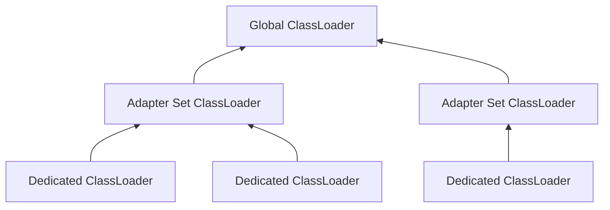

# Deploying Lightstreamer Broker to Kubernetes

This guide provides step-by-step instructions on how to deploy the Lightstreamer Broker to a Kubernetes cluster using the Lightstreamer Helm Chart.

## Table of Contents
- [Prerequisites](#prerequisites)
- [Deployment Steps](#deployment-steps)
- [Customize Lightstreamer Broker](#customize-lightstreamer-broker)
  - [License](#license)
    - [Community Edition](#community-edition)
    - [Enterprise Edition](#enterprise-edition)
  - [Server Socket](#server-socket)
    - [Multiple Servers](#multiple-servers)
    - [TLS/SSL](#tlsssl)
  - [Logging](#logging)
    - [Primary Loggers](#primary-loggers)
    - [Subloggers](#subloggers)
    - [Other Loggers](#other-loggers)
    - [Extra Loggers](#extra-loggers)
    - [Appenders](#appenders)
      - [Log to Persistent Storage](#log-to-persistent-storage)
  - [JMX](#jmx)
    - [RMI Connector](#rmi-connector)
      - [TLS/SSL](#tlsssl-1)
      - [Authentication](#authentication)
  - [Monitoring Dashboard](#monitoring-dashboard)
    - [Authentication](#authentication-1)
    - [Availability on specific server](#availability-on-specific-server)
    - [Custom Dashboard URL path](#custom-dashboard-url-path)
    - [Hands-on example](#hands-on-example)
  - [Adapters](#adapters)
    - [In-process Adapters](#in-process-adapters)
      - [Provisioning](#provisioning)
      - [Configure Metadata Adapters and Data Adapters](#configure-metadata-adapters-and-data-adapters)
        - [`common` ClassLoader](#common-classloader)
        - [`dedicated` ClassLoader](#dedicated-classloader)
        - [`log-enabled` ClassLoader](#log-enabled-classloader)
        - [Summary of ClassLoader types](#summary-of-classloader-types)
  - [Connectors](#connectors)
    - [Kafka Connector](#kafka-connector)
      - [Provisioning](#provisioning-1)
      - [Connections](#connections)
      - [Routing](#routing)
      - [Field Mapping](#field-mapping)
      - [Logging](#logging-1)

## Prerequisites

Before you begin, ensure that you have the following prerequisites:

- **Kubernetes**

  Access to a running Kubernetes cluster version 1.23.5 or newer. [Install Kubernetes](https://kubernetes.io/docs/setup/)

- **Helm**

  Helm client version 3.8.0 or newer installed on your local machine. [Install Helm](https://helm.sh/docs/intro/install/)

- **kubectl**

  kubectl version 1.23.5 or newer, compatible with your cluster version. kubectl is needed to interact with your Kubernetes cluster. [Install kubectl](https://kubernetes.io/docs/tasks/tools/)

## Deployment steps

Follow these steps to deploy the Lightstreamer Broker to your Kubernetes cluster:

1. **Add the Lightstreamer Helm repository:**

    ```sh
    helm repo add lightstreamer https://lightstreamer.github.io/helm-charts
    ```

2. **Update your Helm repositories:**

    ```sh
    helm repo update
    ```

3. **Install the Lightstreamer Helm chart:**

    ```sh
    helm install lightstreamer lightstreamer/lightstreamer \
        --namespace <namespace> \
        --create-namespace
    ```

4. **Wait for the Lightstreamer Broker to be ready:**

    ```sh
    kubectl rollout status deployment lightstreamer --namespace <namespace> --watch
    ```

    Expected output upon the broker is ready:

    ```sh
    deployment "lightstreamer" successfully rolled out
    ```


This will deploy the Lightstreamer Broker and other related components with the default configuration.

For more detailed configuration options, refer to the [Lightstreamer Helm Chart Specification](https://github.com/Lightstreamer/helm-charts/tree/main/charts/lightstreamer).

## Customize Lightstreamer Broker

You can customize the deployment by overriding the default values in two different ways:

1. Use the `--set` option to specify overrides on the command line:

   ```sh
   helm install lightstreamer lightstreamer/lightstreamer \
     --set servers.defaultServer.name="My Lightstreamer HTTP Server" \
     --namespace lightstreamer \
     --create-namespace
   ```

2. Use the `--values` to specify one or more YAMLs file with overrides. For example:

   - Edit the file `default-server.yaml` as follows:

     ```yaml
     servers:
       defaultServer:
         name: "My Lightstreamer HTTP Server"
     ```

   - Run the helm command:

     ```sh
     helm install lightstreamer lightstreamer/lightstreamer \
       --values default-server.yaml \
       --namespace lightstreamer \
       --create-namespace
     ```

For more details about general chart customization, refer to the [official Helm documentation](https://helm.sh/docs/intro/using_helm/#customizing-the-chart-before-installing).

In the following sections, we will guide you on how to customize the values of the Lightstreamer Helm chart to configure the most critical aspects of deploying a Lightstreamer Broker to Kubernetes.

### License

The [`license`](charts/lightstreamer/README.md#license) section configures the edition and license type for the Lightstreamer Broker.

Two editions are available:

- **Community**: Free edition with feature restrictions
- **Enterprise**: Full-featured commercial edition

#### Community edition

The Community edition can be used for free but has the following limitations:

- No TLS/SSL support
- Maximum downstream message rate of 1 message/sec
- Limited features compared to Enterprise edition

See the [Software License Agreement](https://lightstreamer.com/distros/ls-server/7.4.6/Lightstreamer%20Software%20License%20Agreement.pdf) for complete details.

To configure the Community edition:

1. Set `license.edition` to `COMMUNITY`
2. Set `license.enabledCommunityEditionClientApi` with the Client API to use with the free license

Example:

```yaml
license:
  edition: COMMUNITY
  enabledCommunityEditionClientApi:  "javascript_client"
```

#### Enterprise edition

The default configuration uses the Enterprise edition with a _Demo_ license that:

* Can be used for evaluation, development and testing (not production)
* Has a limit of 20 concurrent user sessions

Contact *_info@lightstreamer.com_* for evaluation without session limits or for production licenses

To configure the `ENTERPRISE` edition with a customer license:

1. Set [`license.edition`](../lightstreamer-helm-charts/README.md#licenseedition) to `ENTERPRISE`.
2. Set [`license.enterprise.licenseType`](../lightstreamer-helm-charts/README.md#licenseenterpriselicensetype) to specify license type.
3. Set [`license.enterprise.contractId`](../lightstreamer-helm-charts/README.md#licenseenterprisecontractid) with your contract identifier.
4. Configure license validation using one of these methods:

   **Online Validation**

   For license types: `EVALUATION`, `STARTUP`, `PRODUCTION`, `HOT-STANDBY`, `NON-PRODUCTION-FULL`, `NON-PRODUCTION-LIMITED`

   1. Create password secret:
   ```sh
   kubectl create secret generic <online-password-secret-name> \
     --from-literal=online-password=<online-password> \
     --namespace <namespace>
   ```

   2. Set [`license.enterprise.licenseValidation`](../lightstreamer-helm-charts/README.md#licenseenterpriselicensevalidation) to `ONLINE`.
   
   3. Configure [`license.enterprise.onlinePasswordSecretRef`](../lightstreamer-helm-charts/README.md#licenseenterpriseonlinepasswordsecretref) with the name and the key of the secret generated at step 1.

   Example configuration:
   ```yaml
   license:
     edition: ENTERPRISE
     enterprise:
       licenseType: <license-type>
       contractId: <contract-id>
       licenseValidation: ONLINE              # Use the online-based validation
       onlinePasswordSecretRef:
         name: <online-password-secret-name>  # Secret name from step 1
         key: online-password                 # Secret key from step 1
   ...
   ```

   **File-based Validation**

   For license types: `PRODUCTION`, `HOT-STANDBY`, `NON-PRODUCTION-FULL`, `NON-PRODUCTION-LIMITED`

   1. Create license file secret:
   ```sh
   kubectl create secret generic <license-secret-name> \
     --from-file=license.lic=<path/to/license/file> \
     --namespace <namespace>
   ```

   2. Set [`license.enterprise.licenseValidation`](charts/lightstreamer/README.md#licenseenterpriselicensevalidation) to `FILE`. 

   3. Configure [`license.enterprise.filePathSecretRef`](charts/lightstreamer/README.md#licenseenterprisefilepathsecretref) with the name and the key of the secret generated at step 1.

   Example configuration:
   ```yaml
   license:
     edition: ENTERPRISE
     enterprise:
       licenseType: <license-type>
       contractId: <contract-id>
       licenseValidation: FILE        # Use the file-based validation
       filePathSecretRef:
         name: <license-secret-name>  # Secret name from step 1
         key: license.lic             # Secret key from step 1
   ...
   ```

See the [License settings](charts/lightstreamer/README.md#license) section of the _Lightstreamer Helm Chart specification_ for additional license configuration options.

### Server socket

To configure a new server socket, add a new entry to the [`servers`](charts/lightstreamer/README.md#servers) section with the following mandatory settings:

- [`name`](charts/lightstreamer/README.md#serversdefaultservername): A unique name for the server socket.
- [`port`](charts/lightstreamer/README.md#serversdefaultserverport): The port number the server socket will listen on.

Moreover, set the [`enabled`](charts/lightstreamer/README.md#serversdefaultserverenabled) flag to `true` to include the server socket in the deployment.

Example configuration:

```yaml
servers:
  myServerConfiguration:
    enabled: true
    name: "My Lightstreamer server"
    port: 8080
```

> [!IMPORTANT]
> If you do not want to include the default server socket configuration (`defaultServer`) in the deployment, explicitly disable it as follows:
> ```yaml
> servers:
>   defaultServer:
>     enabled: false
> ...
> ```

#### Multiple servers

Lightstreamer Broker supports managing multiple server sockets. You can define multiple server socket configurations by adding entries under the `servers` section in your values file.
Each configuration must specify a unique name and port.

Example configuration:

```yaml
# Multiple server socket configurations
servers:

  # Server socket listening on port 8081
  httpServer1:
    enabled: true
    name: "HTTP Server 1"
    port: 8081

  # Server socket listening on port 8082
  httpServer2:
    enabled: true
    name: "HTTP Server 2"
    port: 8082

  # Server socket listening on port 8083
  httpServer3:
    enabled: true
    name: "HTTP Server 3"
    port: 8083
```

> [!TIP]
>Ensure that any unused server configurations are explicitly disabled by setting their `enabled` flag to `false`. For example:
> ```yaml
> servers:
>   unusedServer:
>     enabled: false
> ```

#### TLS/SSL

To configure TLS/SSL settings for a server socket configuration, perform the following actions:

- Set the [`enableHttps`](charts/lightstreamer/README.md#serversdefaultserverenablehttps) flag of the target server configuration to `true`:

  ```yaml
  servers:
    defaultServer:
      enableHttps: true
      ...
  ```

- Configure a keystore:

  1. Create a secret containing the keystore:

     ```sh
     $ kubectl create secret generic <keystore-secret-name> --from-file=server.keystore=<path/to/keystore> --namespace <namespace>
     ```

  2. Create a secret containing the keystore password:

     ```sh
     $ kubectl create secret generic <keystore-password-secret-name> --from-literal=password=<keystore-password> --namespace <namespace>
     ```

  3. Define a new keystore in the [`keystores`](charts/lightstreamer/README.md#keystores) section:

     ```yaml
     keystores:
       ...

       serverKeystore:
         # The keystore type, here we assume JKS
         type: JKS

         keystoreFileSecretRef:
           name: <keystore-secret-name> # The name used at step 1
           key: server.keystore         # The secret key as specified at step 1

         keystorePasswordSecretRef:
           name: <keystore-password-secret-name> # The name used at step 2
           key: password                         # The secret key as specified at step 2
     ```

- If required, configure a truststore by repeating similar actions of the previous section:

  1. Create the truststore secrets:

     ```sh
     $ kubectl create secret generic <truststore-secret-name> --from-file=server.truststore=<path/to/truststore> --namespace <namespace>
     $ kubectl create secret generic <truststore-password-secret-name> --from-literal=password=<truststore-password> --namespace <namespace>
     ```

  2. Define a truststore:

     ```yaml
     keystores:
       serverTruststore:
         # The truststore type, here we assume JKS
         type: JKS

         keystoreFileSecretRef:
           name: <truststore-secret-name>
           key: server.truststore

         keystorePasswordSecretRef:
           name: <truststore-password-secret-name>
           key: password
     ```

- Configure the [`sslConfig`](charts/lightstreamer/README.md#serversdefaultserversslconfig) section:

  ```yaml
  servers:
    defaultServer:
      ...
      sslConfig:
        # The reference to the keystore definition
        keystoreRef: serverKeyStore

        # If required, the reference to the truststore definition
        truststoreRef: serverTruststore

        # Other settings
        ...
  ```
See the [`servers.defaultServer.sslConfig`](charts/lightstreamer/README.md#serversdefaultserversslconfig) section of the _Lightstreamer Helm Chart specification_ for additional TLS/SLS configuration options.

### Logging

The provided logging settings are designed to meet the needs of most production environments. However, you can customize the configuration to suit specific requirements.

See the [_Logging_](charts/lightstreamer/README.md#logging) section of the _Lightstreamer Helm Chart specification_ for full details about logging configuration.

#### Primary loggers

The [`logging.loggers`](charts/lightstreamer/README.md#loggingloggers) section defines the primary loggers used by the Lightstreamer Broker:

- [`lightstreamerLogger`](charts/lightstreamer/README.md#loggingloggerslightstreamerlogger): Logs major activities of the Lightstreamer Broker.
- [`lightstreamerMonitorText`](charts/lightstreamer/README.md#loggingloggerslightstreamermonitortext) and [`lightstreamerMonitorTAB`](charts/lightstreamer/README.md#loggingloggerslightstreamermonitortab): Log statistics in text and tabular formats, respectively.
- [`lightstreamerHealthCheck`](charts/lightstreamer/README.md#loggingloggerslightstreamerhealthcheck): Logs health check requests.
- [`lightstreamerProxyAdapters`](charts/lightstreamer/README.md#loggingloggerslightstreamerproxyadapters): Logs activities of Proxy Data and Metadata Adapters.

For each logger, you can configure the following settings:

- `level`: Specifies the logging level. Available levels are `OFF`, `FATAL`, `ERROR`, `WARN`, `INFO`, `DEBUG`, and `TRACE`.
- `appenders`: Lists the appenders used to log messages. Each entry must reference an appender defined in the [`logging.appenders`](charts/lightstreamer/README.md#loggingappenders) section.

Example configuration:
```yaml
logging:
  loggers:
    lightstreamerMonitorText:
      appenders:
        - dailyRolling
      level: DEBUG

    lightstreamerLogger:
      level: TRACE
...
```

#### Subloggers

The [`logging.loggers.lightstreamerLogger.subLoggers`](charts/lightstreamer/README.md#loggingloggerslightstreamerloggersubloggers) section allows you to define logging levels for subloggers of `lightstreamerLogger`. Subloggers inherit appenders from their parent logger.

Example configuration:
```yaml
logging:
  loggers:
    lightstreamerLogger:
      level: INFO
      subLoggers:
        lightstreamerLogger.io: DEBUG
        lightstreamerLogger.io.ssl: DEBUG
...
```

#### Other loggers

The default configuration includes loggers for third-party libraries used by the Broker. These loggers typically do not require modification. Refer to the comments in the [values.yaml](charts/lightstreamer/values.yaml#L1039) file for more details.

Example configuration:
```yaml
logging:
  loggers:
    java.sql:
      appenders:
        - console
      level: WARN

    org.jboss.logging:
      appenders:
        - console
      level: WARN
...
```

#### Extra loggers

To define additional loggers, add entries to the `extraLoggers` section. This is useful for custom logging requirements.

Example configuration:
```yaml
extraLoggers:
  myLogger:
    appenders:
      - console
    level: INFO
...
```

#### Appenders

The [`logging.appenders`](charts/lightstreamer/README.md#loggingappenders) section defines the appenders available for use by loggers. The default configuration includes:

- [`dailyRolling`](charts/lightstreamer/values.yaml#L660): A daily rolling file appender
- [`console`](charts/lightstreamer/values.yaml#L681): A console appender

You can customize these appenders or define new ones.

Example of defining a new appender:
```yaml
logging:
  appenders:
    ...
    anotherConsoleAppender:
      type: Console
      pattern: "[My Custom Appender]|%-27.27t|%m%"
...
```

To use the new appender, reference it in a logger configuration:
```yaml
logging:
  loggers:
    lightstreamerLogger:
      level: INFO
      appenders:
        - anotherConsoleAppender
...
```

##### Log to persistent storage

To persist log files, you can configure the `DailyRollingFile` appender to write to a Kubernetes volume. Here's how to set it up:

1. **Define a volume**

   Configure a volume in the `deployment.extraVolumes` section. You can use various volume types:

   ```yaml
   deployment:
     extraVolumes:
       # Using emptyDir (temporary storage)
       - name: log-volume
         emptyDir: {}

       # Or using PersistentVolumeClaim (permanent storage)
       - name: log-volume
         persistentVolumeClaim:
           claimName: lightstreamer-logs-pvc
   ```

2. **Configure the appender**

   Configure your logging appender to use the volume:

   ```yaml
   logging:
     appenders:
       dailyRollingAppender:
         type: DailyRollingFile
         # Log file format
         pattern: "%d{ISO8601}|%-5p|%-20.20c{1}|%m%n"

         # Log file settings
         fileName: "lightstreamer.log"
         fileNamePattern: "lightstreamer-%d{yyyy-MM-dd}.log"

         # Volume reference
         volumeRef: log-volume
   ```

### JMX

The Lightstreamer Broker exposes a comprehensive set of monitoring metrics and management operations through JMX (Java Management Extensions). This is an optional feature that may not be included in your license.

JMX support is designed to integrate with monitoring and management tools via two protocols:
- _JMXMP_: A pure TCP-based protocol
- _RMI_: The standard Java Remote Method Invocation protocol

See the [JMX API documentation](https://lightstreamer.com/ls-jmx-sdk/latest/api/index.html) for details on available metrics and operations.

#### RMI Connector

The default configuration enables an RMI Connector listening on TCP port `8888`. You can verify this by checking the pod's exposed ports:

```sh
kubectl get pods -l app.kubernetes.io/name=lightstreamer -o jsonpath="{.items[0].spec.containers[0].ports}" --namespace <namespace> | jq
```
> [!TIP]
> Notice the usage of the [`jq`](https://jqlang.org/) tool to simplify the processing of JSON outputs.

Expected output:
```json
[
  {
    "containerPort": 8080,
    "name": "default-server",
    "protocol": "TCP"
  },
  {
    "containerPort": 8888,
    "name": "jmx-port",
    "protocol": "TCP"
  }
]
```

The following example shows how to customize the RMI Connector listening port through the [`management.jmx.rmiConnector.port`](charts/lightstreamer/README.md#managementjmxrmiconnectorport) setting:

```yaml
management:
  jmx:
    rmiConnector:
      port:
        value: 9999
```

See the [`management.jmx.rmiConnector`](charts/lightstreamer/README.md#managementjmxrmiconnector) section of the _Lightstreamer Helm Chart specification_ for full details about other configurable RMI Connector settings.

##### TLS/SSL

To enable TLS/SSL communication, turn on the optional [`management.jmx.rmiConnector.port.enableSsl`](charts/lightstreamer/README.md#managementjmxrmiconnectorportenablessl) flag and reference a keystore trough [`management.jmx.rmiConnector.keystoreRef`](charts/lightstreamer/README.md#managementjmxrmiconnectorsslconfigkeystoreref) (as already explained in the [_TLS/SSL_](#tlsssl) ):

```yaml
management:
  jmx:
    rmiConnector:
      port:
        value: 9999
        enableSsl: true        # Enables TLS/SSL communication
      keystoreRef: rmiKeystore # Reference to a keystore
```

> [!WARNING]
> Make sure to enable TLS/SSL communication in a production deployment.

See the [`management.jmx.rmiConnector.sslConfig`](charts/lightstreamer/README.md#managementjmxrmiconnectorsslconfig) section of the _Lightstreamer Helm Chart specification_ for additional TLS/SSL configuration options for the RMI Connector. 

##### Authentication

To restrict access to authorized users, first create the relative secrets (every one including the mandatory keys `user` and `password`). For example:

```sh
kubectl create secret generic rmi-user-1-secret --from-literal=user=<user-1> --from-literal=password='<user1-password>' --namespace <namespace>
kubectl create secret generic rmi-user-2-secret --from-literal=user=<user-2>' --from-literal=password='<user2-password>' --namespace <namespace>
```

Then, disable public access turning off the [`management.jmx.rmiConnector.enablePublicAccess`](charts/lightstreamer/README.md#managementjmxrmiconnectorenablepublicaccess) flag and populate the [`management.jmx.rmiConnector.credentialsSecrets`](charts/lightstreamer/README.md#managementjmxrmiconnectorcredentialssecrets) list with the references to the secrets.

Example:
```yaml
management:
  jmx:
    rmiConnector:
      enablePublicAccess: false # Requires authenticated RMI Connector access
      credentialsSecrets:       # List of secrets
        - rmi-user-1-secret     
        - rmi-user-2-secret
```

> [!WARNING]
> Make sure to enable authenticated access in a production deployment.

### Monitoring Dashboard

The _Monitoring Dashboard_ provides a web interface for monitoring and managing a Lightstreamer Broker instance. It includes several tabs showing basic monitoring statistics in graphical form and a JMX Tree view that enables data viewing and management operations from the browser.

Since the Dashboard enables remote management, including server shutdown, it is critical to secure access in a production environment by applying the following recommended actions:

- Require authentication for Dashboard access.
- Create users with different levels of access to the JMX Tree.
- Restrict the Dashboard to HTTPS servers only (if TLS/SSL is allowed by our license)
- Customize the dashboard URL path.

#### Authentication

To restrict access, create Kubernetes secrets for Dashboard users and configure authentication:

1. Create secrets for Dashboard users:

   ```sh
   # Create secret for the first dashboard user
   kubectl create secret generic dashboard-user1-secret \
     --from-literal=user=admin \
     --from-literal=password='secretpass' \
     --namespace <namespace>
 
   # Create secret for the second dashboard user
   kubectl create secret generic dashboard-user2-secret \
     --from-literal=user=monitor \
     --from-literal=password='monitorpass' \
     --namespace <namespace>
   ```
 
  > [!IMPORTANT]
  > Secrets must include the mandatory keys `user` and `password`.

2. Configure authentication:

   ```yaml
   management:
     dashboard:
       enablePublicAccess: false  # Disable public access
       enableJmxTree: true        # Globally enable JMX Tree view
   
       credentials:
         - secretRef: dashboard-user1-secret
           enableJmxTreeVisibility: true  # Allow JMX Tree access
         - secretRef: dashboard-user2-secret
           enableJmxTreeVisibility: false # Restrict JMX Tree access
   ```

#### Availability on specific server

To limit the Dashboard's availability to specific servers, configure the following in the Helm chart values:

```yaml
management:
  dashboard:
    enableAvailabilityOnAllServers: false  # Disable availability on all servers

    availableOnServers:
      - serverRef: httpsServer         # Reference to a socket configuration defined the servers section
        enableJmxTreeVisibility: true  # Allow JMX Tree access
```

#### Custom Dashboard URL path

To change the default Dashboard url:

```yaml
management:
  dashboard:
    ...
    urlPath: /monitoring  # Custom dashboard path
```

#### Hands-on example

The [examples/dashboard](examples/dashboard/) directory provides a complete example of Dashboard configuration that shows how to:

- Configure a dedicated HTTPS server socket for secure Dashboard access
- Set up user authentication with different permission levels
- Customize the Dashboard URL path

See the [`management.dashboard`](charts/lightstreamer/README.md#managementdashboard) section of the _Helm Lightstreamer Chart specification_ for full details about available Monitoring Dashboard settings.

### Adapters

Lightstreamer Adapters are custom server-side components attached to the Lightstreamer Broker, whose role is to interface the Lightstreamer Kernel with any data source, as well as to implement custom authentication and authorization logic. 

Each Adapter Set consists of:

- A **Metadata Adapter**: Handles client authentication, authorization, and item validation
- One or more **Data Adapters**: Receive data from back-end systems and forward it to the Kernel for delivery to users

Lightstreamer Adapters can be implemented in two ways:
- **In-Process Adapters**: Java classes running within the Lightstreamer Broker's JVM
- **Remote Adapters**: External processes communicating with the Lightstreamer Broker through the Remote Server API

See the _The Adapters_ chapter of the [_General Concepts_](https://lightstreamer.com/ls-server/latest/docs/General%20Concepts.pdf) document to learn more about Lightstreamer Adapters.

To define an Adapter Set, add a new configuration to [`adapters`](charts/lightstreamer/README.md#adapters) section with the following mandatory settings:

- [`id`](charts/lightstreamer/README.md#adaptersmyadaptersetid): A unique id for the adapter set
- [`metadataProvider`](charts/lightstreamer/README.md#adaptersmyadaptersetmetadataprovider): A Metadata Adapter configuration
- [`dataProviders`](charts/lightstreamer/README.md#adaptersmyadaptersetmetadataprovider): One or more Data Adapter configurationA Metadata Adapter configuration

Moreover, set the [`enabled`](charts/lightstreamer/README.md#adaptersmyadaptersetenabled) flag to `true` to include the adapter set in in the deployment.

Example configuration:

```yaml
adapters:
  # Define an Adapter Set configuration
  myAdapterSet:
    
    enabled: true

    id: "MY_ADAPTER_SET"

    metadataProvider:
    ...

    dataProviders:
    ...
    
```

#### In-process Adapters

To configure in-process Metadata Adapter, you have to accomplish the following steps:

1. Provision the Adapter Set's resources.
3. Configure Metadata Adapter and Data Adapter(s).

##### Provisioning

Adapter Sets can be provisioned using different methods, configured through the [`provisioning`](charts/lightstreamer/README.md#adaptersmyadaptersetprovisioning) section:

1. Embed the Adapter Set's resources in the image

   - Build a custom Lightstreamer-based container image by copying the adapter's resources into the `/lightstreamer/adapters` directory of the image:
   
     ```yaml
     # Dockerfile example
     FROM lightstreamer
     COPY myadapter /lightstreamer/adapters/myadapter
     ...
     
     ```

     **IMPORTANT** Do not include the usual `adapters.xml` file, which is normally required to deploy an Adapter Set in a non-Kubernetes environment, as the file will be dynamically rendered according to the provided configuration in the Helm chart values.
   
   - Update [`image.repository`](charts/lightstreamer/README.md#imagerepository) with the reference to the new image:

     ```yaml
     image:
       repository: lightstreamer
     ```
   
   - Configure the [`provisioning.fromPathInImage`](charts/lightstreamer/README.md#adaptersmyadaptersetprovisioningfrompathinimage) setting of the Adapter Set definition with the full path of the deployment folder:
     
     ```yaml
     adapters:
       myAdapterSet:
         provisioning:
           fromPathInImage: /lightstreamer/adapters/myadapter
     ...
     ```
   
   At startup, the resources will be copied path will be mounted at the `/deployed_adapters` directory in the container.

2. Deploy the Adapter Set's resource to a persistent storage

   - Configure a volume in the `deployment.extraVolumes` section:

     ```yaml
     deployment:
       extraVolumes:
         # Using PersistentVolumeClaim (permanent storage)
         - name: adapters-volume
           persistentVolumeClaim:
             claimName: lightstreamer-adapters-pvc
     ```

     and populate it with the Adapter Set's resources (excluding any `adapters.xml` file).

   - Configure the [`provisioning.fromPath`](charts/lightstreamer/README.md#adaptersmyadaptersetprovisioningfrompathinimage) setting of the Adapter Set definition with the reference to the volume and optionally the deployment full path in the volume:
     
     ```yaml
     adapters:
       myAdapterSet:
         provisioning:
           fromVolume:
             name: adapters-volume
             path: path/to/adapter/set
     ...
     ```

     At startup, the resources will be copied to the designated Adapter Set folder under the `/deployed_adapters` directory in the container.

##### Configure Metadata Adapters and Data Adapters

You can configure in-process Metadata Adapters and Data Adapters by populating the following sections in your Helm chart values:

- [`metadataProvider.inProcessMetadataAdapter`](charts/lightstreamer/README.md#adaptersmyadaptersetmetadataproviderinprocessmetadataadapter)
- [`dataProviders.<dataProviderName>.inProcessDataAdapter`](charts/lightstreamer/README.md#adaptersmyadaptersetdataprovidersmydataproviderinprocessdataadapter)

These sections share the following key settings:

- `adapterClass`: The fully qualified name of the Java class implementing the Adapter.

- `installDir`:  The optional location in the provisioning source of top-level directory containing the `lib` and/or `classes` folders.

- `classLoader`: The type of ClassLoader to use for loading the Adapter's classes, how explained in the subsequent sections.

###### `common` ClassLoader

When the `classLoader` is set to `common`, the _Adapter Set ClassLoader_ is used. 
This ClassLoader load classes included in the `lib` and `classes` subfolders from three different sources:

1. The Adapter Set's directory:

   ```sh
   my-adapter-set/
   ├── classes # Common classes
   └── lib     # Common jar files
   ```
   
   Example configuration:
   ```yaml
   adapters:
     exampleAdapterSet:
       metadataProvider:
         inProcessMetadataAdapter:
           adapterClass: com.lightstreamer.adapters.example.first.
           classLoader: common 
           ...
       dataProviders:
         myDataProvider:
           inProcessDataAdapter:
             adapterClass: com.mycompany.adapters.data.MyDataAdapter
             classLoader: common
            ...
   ```

2. The specified `installDir`:

   ```sh
   my-adapter-set/
   ├── classes # Common classes
   ├── lib     # Common jar files
   └── metadata    # Metadata Adapter-specific resources
       ├── classes 
       └── lib     
   └── data        # Data Adapter-specific resources
       ├── classes 
       └── lib     
   ```

   Example configuration:
   ```yaml
   adapters:
     myAdapterSet:
       metadataProvider:
         inProcessMetadataAdapter:
           adapterClass: com.mycompany.adapters.metadata.MyMetadataAdapter
           installDir: metadata # Metadata Adapter-specific resources
           classLoader: common
           ...
       dataProviders:
         myDataProvider:
           inProcessDataAdapter:
             adapterClass: com.mycompany.adapters.metadata.MyMetadataAdapter
             installDir: data # Data Adapter-specific resources
             classLoader: common
             ...
   ```

3. The Lightstreamer Broker's `shared` folder:

   The Adapter Set ClassLoader inherits from a global ClassLoader, which includes classes and resources from the `shared` folder of the Lightstreamer Broker deployment. This allows multiple Adapter Sets to share common resources.

   ```mermaid
   flowchart BT
     A1[Adapter Set ClassLoader]-->G[Global ClassLoader] 
     A2[Adapter Set ClassLoader]-->G[Global ClassLoader] 
     A3[Adapter Set ClassLoader]-->G[Global ClassLoader]  
   ```
    
   Example shared directory structure:
   ```sh
   /lightstreamer/shared/
   ├── classes # Globally shared classes
   └── lib     # Globally shared jar files
   ```

###### `dedicated` ClassLoader

When the `classLoader` is set to `dedicated`, a dedicated ClassLoader is assigned to the Adapter. This ClassLoader includes classes from the `<installDir>/lib` and `<installDir>/classes` folders. The `installDir` setting is mandatory in this case.



Example configuration:

```sh
adapters/my-adapter-set/
├── classes     # Common classes loaded by the Adapter Set ClassLoader
├── lib         # Common jar files loaded by the Adapter Set ClassLoader
└── metadata    
    ├── classes # Classes and resources loaded by the dedicated Metadata Adapter's ClassLoader
    └── lib     # Jar files loaded by the dedicated Metadata Adapter's ClassLoader
└── data        
    ├── classes # Classes and resources loaded by the dedicated Data Adapter's ClassLoader
    └── lib     # Jar files loaded by the dedicated Data Adapters's ClassLoader
```

The following example:

```yaml
adapters:
  myAdapterSet:
    metadataProvider:
      inProcessMetadataAdapter:
        adapterClass: com.mycompany.adapters.metadata.MyMetadataAdapter
        installDir: metadata 
        classLoader: dedicated
        ...
    dataProviders:
      myDataProvider:
        inProcessDataAdapter:
          adapterClass: com.mycompany.adapters.metadata.MyMetadataAdapter
          installDir: data 
          classLoader: dedicated 
          ...
```

###### `log-enabled` ClassLoader

When the `classLoader` is set to `log-enabled`, the Adapter is assigned a dedicated ClassLoader which also includes the `slf4j` library used by the Lightstreamer Broker.
This implies that the Adapter the Broker's logging configuration. 
The ClassLoader does not inherit from the Adapter Set ClassLoader, hence the Adapter cannot share classes with other Adapters.

Example configuration:
```yaml
adapters:
  myAdapterSet:
    metadataProvider:
      inProcessMetadataAdapter:
        adapterClass: com.mycompany.adapters.metadata.MyMetadataAdapter
        classLoader: log-enabled
    dataProviders:
      myDataProvider:
        inProcessDataAdapter:
          adapterClass: com.mycompany.adapters.data.MyDataAdapter
          classLoader: log-enabled
```

###### Summary of ClassLoader types

| ClassLoader Type | Description                                                                                     | Use Case                                                                 |
|------------------|-------------------------------------------------------------------------------------------------|--------------------------------------------------------------------------|
| `common`         | Uses the Adapter Set ClassLoader, which includes all classes in the `lib` and `classes` folders | Suitable for simple setups where all adapters share the same resources   |
| `dedicated`      | Assigns a dedicated ClassLoader to the Adapter, inheriting from the Adapter Set ClassLoader     | Useful when adapters require isolated resources or specific dependencies |
| `log-enabled`    | Includes the `slf4j` library and shares the Broker's logging configuration                     | Suitable for adapters that need to integrate with the Broker's logging   |

By carefully organizing your Adapter Set's directory structure and selecting the appropriate `classLoader` type, you can optimize resource sharing and ensure proper isolation between adapters.

##### Proxy Adapters

### Connectors

Lightstreamer Connectors are specialized adapter sets that enable seamless integration between Lightstreamer Broker and external messaging systems or data sources. Unlike general-purpose adapters, connectors are purpose-built to bridge Lightstreamer with specific platforms, providing optimized data flow and simplified configuration.

Connectors handle:
- **Data Ingestion**: Consuming data from external systems and transforming it into Lightstreamer-compatible formats
- **Protocol Translation**: Managing communication protocols between Lightstreamer and external platforms
- **Schema Management**: Handling data serialization formats (JSON, Avro, Protobuf, etc.)
- **Connection Management**: Maintaining reliable connections to external systems with automatic reconnection and error handling

Currently, the Kafka Connector is the only connector available in this Helm chart. Each connector is configured and enabled independently within the [`connectors`](charts/lightstreamer/README.md#connectors) section.

#### Kafka Connector

The Lightstreamer Kafka Connector enables real-time streaming of data from Apache Kafka topics to Lightstreamer clients. It acts as a bridge between Kafka's publish-subscribe messaging system and Lightstreamer's real-time data delivery infrastructure, allowing web and mobile applications to receive Kafka messages with low latency.

**Key Features:**
- Native integration with Apache Kafka and Kafka-compatible platforms (Amazon MSK, Confluent Cloud, etc.)
- Support for multiple serialization formats: String, JSON, Avro, Protobuf, and key-value pairs
- Schema Registry integration for Avro and Protobuf
- Flexible topic-to-item routing with template-based mapping
- TLS/SSL encryption and multiple authentication mechanisms (SASL/PLAIN, SCRAM, GSSAPI, AWS IAM)
- Independent connection configurations for different Kafka clusters

For complete documentation, see the [Lightstreamer Kafka Connector project on GitHub](https://github.com/Lightstreamer/Lightstreamer-kafka-connector).

To configure the Kafka Connector, define its settings in the [`connectors.kafkaConnector`](charts/lightstreamer/README.md#connectorskafkaconnector) section:

```yaml
connectors:
  kafkaConnector:
    enabled: true
    adapterSetId: "KafkaConnector"
    
    provisioning:
      # Provision method
    
    routing:
      # Topic-to-item mapping

    connections:
      # Connection configurations
    
    logging:
      # Logging settings
```

##### Provisioning

The Kafka Connector must be provisioned before it can be used. The Helm chart supports multiple provisioning methods through the [`provisioning`](charts/lightstreamer/README.md#connectorskafkaconnectorprovisioning) section:

1. **From GitHub Release** (Recommended)

   Automatically download and deploy a specific version from GitHub:

   ```yaml
   connectors:
     kafkaConnector:
       enabled: true
       provisioning:
         fromGitHubRelease: 1.3.2
   ```

2. **From URL**

   Download from a custom URL:

   ```yaml
   connectors:
     kafkaConnector:
       enabled: true
       provisioning:
         fromUrl: https://example.com/kafka-connector.zip
   ```

3. **From Volume**

   Use a connector package stored in a mounted volume:

   ```yaml
   connectors:
     kafkaConnector:
       enabled: true
       provisioning:
         fromVolume:
           name: my-volume
           filePath: kafka-connector/lightstreamer-kafka-connector-1.3.2.zip
   ```

4. **From Path in Image**

   Use a connector pre-installed in a custom container image:

   ```yaml
   connectors:
     kafkaConnector:
       enabled: true
       provisioning:
         fromPathInImage: /lightstreamer/adapters/lightstreamer-kafka-connector-1.3.2
   ```

##### Connections

The Kafka Connector supports multiple independent connections to different Kafka brokers or clusters. Each connection is defined in the [`connections`](charts/lightstreamer/README.md#connectorskafkaconnectorconnections) map:

```yaml
connectors:
  kafkaConnector:
    enabled: true
    adapterSetId: "KafkaConnector"
    
    provisioning:
      fromGitHubRelease: 1.3.2
    
    connections:
      # Connection 1: Basic configuration
      myKafkaCluster:
        name: "Production-Kafka"
        enabled: true
        bootstrapServers: "kafka-broker-1:9092,kafka-broker-2:9092"
        groupId: "lightstreamer-consumer-group"
        
        record:
          consumeFrom: LATEST  # or EARLIEST
          keyEvaluator:
            type: STRING
          valueEvaluator:
            type: JSON
```

**Bootstrap Servers**: Specify one or more Kafka broker addresses using [`bootstrapServers`](charts/lightstreamer/README.md#connectorskafkaconnectorconnectionsaconnectionconfigurationbootstrapservers). For Kafka deployed in Kubernetes, use the service DNS name:

```yaml
bootstrapServers: "kafka-0.kafka-headless.kafka:9092"
```

**Record Evaluation**: Configure how Kafka message keys and values are deserialized through [`record.keyEvaluator`](charts/lightstreamer/README.md#connectorskafkaconnectorconnectionsaconnectionconfigurationrecordkeyevaluator) and [`record.valueEvaluator`](charts/lightstreamer/README.md#connectorskafkaconnectorconnectionsaconnectionconfigurationrecordvalueevaluator):

- `STRING`: Plain text
- `JSON`: JSON objects
- `AVRO`: Avro serialized data (requires Schema Registry or local schema)
- `PROTOBUF`: Protocol Buffers (requires Schema Registry or local schema)
- `INTEGER`, `BOOLEAN`, `FLOAT`, etc.: Primitive types

**Authentication**: For secure Kafka clusters, configure authentication through [`authentication`](charts/lightstreamer/README.md#connectorskafkaconnectorconnectionsaconnectionconfigurationauthentication):

```yaml
connections:
  secureKafka:
    enabled: true
    bootstrapServers: "secure-kafka:9093"
    
    # TLS/SSL Configuration
    sslConfig:
      enabled: true
      enableHostnameVerification: true
      keystoreRef: myKafkaKeystore
      truststoreRef: myKafkaTruststore
    
    # SASL Authentication
    authentication:
      enabled: true
      mechanism: SCRAM-SHA-512
      credentialsSecretRef: kafka-credentials
```

The [`credentialsSecretRef`](charts/lightstreamer/README.md#connectorskafkaconnectorconnectionsaconnectionconfigurationauthenticationcredentialssecretref) must reference a Kubernetes Secret containing `user` and `password` keys.

##### Routing

Routing configuration maps Kafka topics to Lightstreamer items. Define routing rules in the [`routing`](charts/lightstreamer/README.md#connectorskafkaconnectorconnectionsaconnectionconfigurationrouting) section:

```yaml
connections:
  myKafkaCluster:
    enabled: true
    bootstrapServers: "kafka:9092"
    
    record:
      keyEvaluator:
        type: STRING
      valueEvaluator:
        type: JSON
    
    routing:
      # Define item templates
      itemTemplates:
        stockTemplate: stock-#{index=KEY}
        sensorTemplate: sensor-#{building=VALUE.building}-#{room=VALUE.room}
      
      # Map topics to item templates
      topicMappings:
        stock-prices:
          topic: 'stock'
          itemTemplateRefs:
            - stockTemplate
        
        iot-sensors:
          topic: 'sensors'
          itemTemplateRefs:
            - sensorTemplate
```

**Item Templates** use extraction expressions to dynamically generate item names from message content:
- `#{index=KEY}`: Use the message key
- `#{index=VALUE.fieldName}`: Extract from a JSON field
- `#{index=PARTITION}`: Use the partition number
- `#{index=TOPIC}`: Use the topic name

**Topic Mappings** associate Kafka topics with item templates. When a message arrives from a topic, the connector applies the specified templates to generate Lightstreamer item names.

##### Field Mapping

Field mapping defines how Kafka message content is transformed into Lightstreamer fields. Configure mappings in the [`fields`](charts/lightstreamer/README.md#connectorskafkaconnectorconnectionsaconnectionconfigurationfields) section:

```yaml
connections:
  myKafkaCluster:
    enabled: true
    
    record:
      valueEvaluator:
        type: JSON
    
    fields:
      mappings:
        # Map all JSON fields
        "*": "#{VALUE.*}"
        
        # Or map specific fields
        timestamp: "#{VALUE.timestamp}"
        price: "#{VALUE.price}"
        volume: "#{VALUE.volume}"
        symbol: "#{VALUE.symbol}"
        
        # Use message metadata
        kafka_topic: "#{TOPIC}"
        kafka_partition: "#{PARTITION}"
        kafka_offset: "#{OFFSET}"
      
      enableSkipFailedMapping: true
```

Extraction expressions support:
- `#{VALUE.path}`: Extract from message value (supports nested JSON paths)
- `#{KEY}`: Use the message key
- `#{TOPIC}`, `#{PARTITION}`, `#{OFFSET}`, `#{TIMESTAMP}`: Kafka metadata

Set [`enableSkipFailedMapping`](charts/lightstreamer/README.md#connectorskafkaconnectorconnectionsaconnectionconfigurationfieldsenableskipfailedmapping) to `true` to continue processing even if some field extractions fail.

##### Logging

Configure connector-specific logging through the [`logging`](charts/lightstreamer/README.md#connectorskafkaconnectorlogging) section:

```yaml
connectors:
  kafkaConnector:
    enabled: true
    
    # Global connector logging
    logging:
      appenders:
        console:
          type: Console
          pattern: "%d|%-10c{1}|%-5p|%m%n"
        
        dailyRolling:
          type: DailyRollingFile
          fileName: kafka-connector.log
          fileNamePattern: kafka-connector-%d{yyyy-MM-dd}.log
          pattern: "[%d] [%-10c{1}] %-5p %m%n"
          volumeRef: my-logs-volume
      
      loggers:
        com.lightstreamer.kafka.adapters.pub.KafkaConnectorMetadataAdapter:
          level: INFO
          appenders:
            - console
        
        org.apache.kafka:
          level: WARN
          appenders:
            - console
    
    connections:
      myKafkaCluster:
        enabled: true
        
        # Connection-specific logging
        logger:
          level: DEBUG
          appenders:
            - console
```

Connection-specific loggers inherit from the global configuration but can be overridden using the [`logger`](charts/lightstreamer/README.md#connectorskafkaconnectorconnectionsaconnectionconfigurationlogger) setting.

**Complete Example**

Here's a complete Kafka Connector configuration example:

```yaml
connectors:
  kafkaConnector:
    enabled: true
    adapterSetId: "KafkaConnector"
    
    provisioning:
      fromGitHubRelease: 1.3.2
    
    logging:
      appenders:
        kafkaLogs:
          type: Console
          pattern: "%d|%-10c{1}|%-5p|%m%n"
    
    connections:
      stockPrices:
        name: "Stock-Prices-Connection"
        enabled: true
        bootstrapServers: "kafka-0.kafka-headless.kafka:9092"
        groupId: "lightstreamer-stocks"
        
        record:
          consumeFrom: EARLIEST
          keyEvaluator:
            type: STRING
          valueEvaluator:
            type: JSON
        
        routing:
          itemTemplates:
            stockItem: stock-#{index=KEY}
          
          topicMappings:
            stocks:
              topic: 'stock-prices'
              itemTemplateRefs:
                - stockItem
        
        fields:
          mappings:
            "*": "#{VALUE.*}"
          enableSkipFailedMapping: true
        
        logger:
          level: INFO
          appenders:
            - kafkaLogs
```

See the [examples/kafka-connector](examples/kafka-connector/) directory for additional configuration examples, and refer to the [`connectors.kafkaConnector`](charts/lightstreamer/README.md#connectorskafkaconnector) section of the _Lightstreamer Helm Chart specification_ for complete configuration details.
