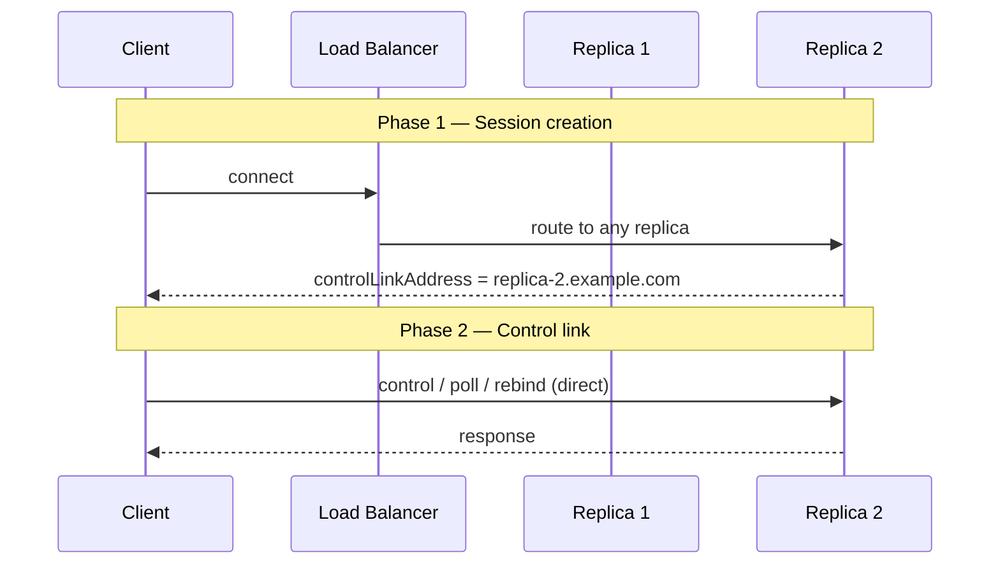
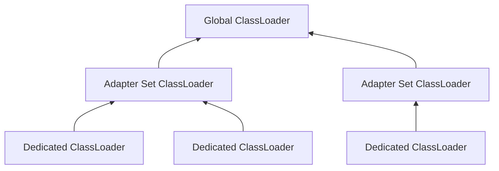
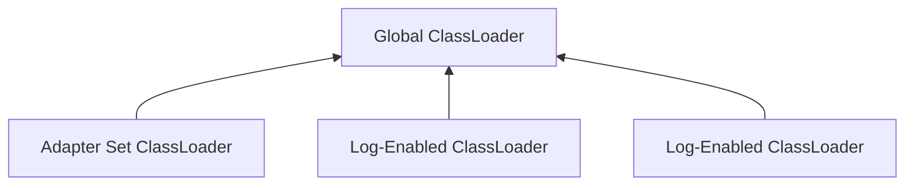

# Deploying Lightstreamer Broker to Kubernetes

This guide covers deploying, configuring, and managing the Lightstreamer Broker on a Kubernetes cluster using the Lightstreamer Helm Chart.

## Table of contents
- [Prerequisites](#prerequisites)
- [Deployment steps](#deployment-steps)
- [Upgrading](#upgrading)
- [Uninstalling](#uninstalling)
- [Troubleshooting](#troubleshooting)
- [Customize Lightstreamer Broker](#customize-lightstreamer-broker)
  - [Getting started](#getting-started)
  - [Name overrides](#name-overrides)
  - [Common labels](#common-labels)
  - [Image settings](#image-settings)
  - [Service account](#service-account)
  - [Deployment](#deployment)
    - [Replicas and update strategy](#replicas-and-update-strategy)
    - [Resources](#resources)
    - [Probes](#probes)
    - [Environment and initialization](#environment-and-initialization)
    - [Scheduling](#scheduling)
    - [Annotations](#annotations)
    - [Security context](#security-context)
    - [Additional volumes](#additional-volumes)
  - [Service](#service)
  - [Ingress](#ingress)
  - [Autoscaling](#autoscaling)
  - [License](#license)
    - [Community edition](#community-edition)
    - [Enterprise edition](#enterprise-edition)
  - [Server socket](#server-socket)
    - [Multiple servers](#multiple-servers)
    - [TLS/SSL](#tlsssl)
  - [Keystores](#keystores)
    - [Creating a keystore](#creating-a-keystore)
  - [Global socket](#global-socket)
  - [Security](#security)
  - [Logging](#logging)
    - [Primary loggers](#primary-loggers)
    - [Subloggers](#subloggers)
    - [Other loggers](#other-loggers)
    - [Extra loggers](#extra-loggers)
    - [Appenders](#appenders)
      - [Log to persistent storage](#log-to-persistent-storage)
  - [Management](#management)
    - [JMX](#jmx)
      - [RMI connector](#rmi-connector)
        - [TLS/SSL](#tlsssl-1)
        - [Authentication](#authentication)
    - [Monitoring Dashboard](#monitoring-dashboard)
      - [Authentication](#authentication-1)
      - [Availability on specific server](#availability-on-specific-server)
      - [Custom dashboard URL path](#custom-dashboard-url-path)
    - [Health check](#health-check)
  - [Push session](#push-session)
  - [Mobile push notifications](#mobile-push-notifications)
  - [Web server](#web-server)
  - [Cluster](#cluster)
    - [Number of nodes](#number-of-nodes)
    - [Resource sizing](#resource-sizing)
    - [Session affinity approaches](#session-affinity-approaches)
  - [Load](#load)
  - [Adapters](#adapters)
    - [Defining an Adapter Set](#defining-an-adapter-set)
    - [Other Adapter Set options](#other-adapter-set-options)
    - [In-Process Adapters](#in-process-adapters)
      - [Provisioning](#provisioning)
      - [Configure Metadata Adapters and Data Adapters](#configure-metadata-adapters-and-data-adapters)
      - [ClassLoader types](#classloader-types)
        - [`common` ClassLoader](#common-classloader)
        - [`dedicated` ClassLoader](#dedicated-classloader)
        - [`log-enabled` ClassLoader](#log-enabled-classloader)
        - [Summary of ClassLoader types](#summary-of-classloader-types)
    - [Proxy Adapters](#proxy-adapters)
    - [Mixed configuration](#mixed-configuration)
    - [WELCOME Adapter Set](#welcome-adapter-set)
  - [Connectors](#connectors)
    - [Kafka Connector](#kafka-connector)
      - [Provisioning](#provisioning-1)
      - [Connections](#connections)
      - [Routing](#routing)
      - [Field mapping](#field-mapping)
      - [Logging](#logging-1)

## Prerequisites

Before you begin, ensure that you have the following prerequisites:

- **Kubernetes**

  Access to a running Kubernetes cluster version 1.23.5 or newer. [Install Kubernetes](https://kubernetes.io/docs/setup/)

- **Helm**

  Helm client version 3.8.0 or newer installed on your local machine. [Install Helm](https://helm.sh/docs/intro/install/)

- **kubectl**

  kubectl version 1.23.5 or newer, compatible with your cluster version. kubectl is needed to interact with your Kubernetes cluster. [Install kubectl](https://kubernetes.io/docs/tasks/tools/)

## Deployment steps

Follow these steps to deploy the Lightstreamer Broker to your Kubernetes cluster:

1. **Add the Lightstreamer Helm repository:**

    ```sh
    helm repo add lightstreamer https://lightstreamer.github.io/helm-charts
    ```

2. **Update your Helm repositories:**

    ```sh
    helm repo update
    ```

3. **Install the Lightstreamer Helm chart:**

    ```sh
    helm install lightstreamer lightstreamer/lightstreamer \
        --namespace <namespace> \
        --create-namespace
    ```

4. **Wait for the Lightstreamer Broker to be ready:**

    ```sh
    kubectl rollout status deployment lightstreamer --namespace <namespace> --watch
    ```

    Expected output once the broker is ready:

    ```sh
    deployment "lightstreamer" successfully rolled out
    ```

This will deploy the Lightstreamer Broker and other related components with the default configuration.

For more detailed configuration options, refer to the [Lightstreamer Helm Chart Specification](https://github.com/Lightstreamer/helm-charts/tree/main/charts/lightstreamer).

## Upgrading

Before applying changes, review what will be modified:

```sh
helm diff upgrade lightstreamer lightstreamer/lightstreamer \
    --values my-values.yaml \
    --namespace <namespace>
```

> [!TIP]
> The `helm diff` command requires the [Helm Diff plugin](https://github.com/databus23/helm-diff). Install it with `helm plugin install https://github.com/databus23/helm-diff`.

Then apply configuration changes or upgrade to a newer chart version with `helm upgrade`:

```sh
helm upgrade lightstreamer lightstreamer/lightstreamer \
    --values my-values.yaml \
    --namespace <namespace>
```

When upgrading to a new chart version, update the repository first:

```sh
helm repo update
helm upgrade lightstreamer lightstreamer/lightstreamer \
    --values my-values.yaml \
    --namespace <namespace>
```

To check available chart versions:

```sh
helm search repo lightstreamer --versions
```

> [!IMPORTANT]
> Always review the chart's release notes before upgrading to a new version. Breaking changes to `values.yaml` keys may require updates to your values files.

## Uninstalling

To remove the Lightstreamer Broker from your cluster:

```sh
helm uninstall lightstreamer --namespace <namespace>
```

This deletes all Kubernetes resources created by the Helm release (Deployment, Service, Ingress, ConfigMaps, etc.). However, resources you created manually — such as Secrets for licenses, keystores, or adapter credentials — and PersistentVolumeClaims are **not** removed automatically. Delete them separately if they are no longer needed:

```sh
kubectl delete secret <secret-name> --namespace <namespace>
kubectl delete pvc <pvc-name> --namespace <namespace>
```

If no other releases use the namespace, you can remove it entirely:

```sh
kubectl delete namespace <namespace>
```

## Troubleshooting

This section covers common issues encountered during deployment. For Lightstreamer Broker configuration and runtime troubleshooting, refer to the [official documentation](https://lightstreamer.com/docs).

### Checking pod status

Start by inspecting the pod state:

```sh
kubectl get pods -l app.kubernetes.io/name=lightstreamer --namespace <namespace>
```

For more detail on a specific pod:

```sh
kubectl describe pod <pod-name> --namespace <namespace>
```

### Viewing broker logs

Retrieve the broker's stdout logs:

```sh
kubectl logs <pod-name> --namespace <namespace>
```

To follow logs in real-time:

```sh
kubectl logs <pod-name> --namespace <namespace> --follow
```

If the pod is crash-looping, inspect logs from the previous run:

```sh
kubectl logs <pod-name> --namespace <namespace> --previous
```

For more granular logging, adjust log levels as described in the [Logging](#logging) section.

### Inspecting rendered configuration

To see the Kubernetes manifests the chart generates without deploying them:

```sh
helm template lightstreamer lightstreamer/lightstreamer \
    --values my-values.yaml \
    --namespace <namespace>
```

To inspect the manifests of an existing release:

```sh
helm get manifest lightstreamer --namespace <namespace>
```

### Common issues

| Symptom | Likely cause | Resolution |
|---|---|---|
| `ImagePullBackOff` | Wrong `image.repository` or `image.tag`, or missing pull secret | Verify the image exists in the registry and that `imagePullSecrets` is configured correctly. See [Image settings](#image-settings) |
| `CrashLoopBackOff` | Invalid license, port conflict, missing keystore, or misconfigured adapter | Check pod logs with `kubectl logs --previous`. Verify [License](#license) and [Keystores](#keystores) configuration |
| `Pending` | Insufficient CPU/memory, unsatisfiable `nodeSelector`, or no available PersistentVolumes | Run `kubectl describe pod` to check the Events section. Review [Resources](#resources) and [Scheduling](#scheduling) |
| Pod running but Service unreachable | `service.ports[].targetPort` does not match any server socket name | Ensure each `targetPort` references a server name defined in [Server socket](#server-socket) |
| Ingress returns 502/504 | Ingress controller is timing out long-lived streaming connections | Set appropriate proxy timeout annotations on the Ingress. See [Ingress](#ingress) |
| JMX/Dashboard not accessible | Port not exposed, or firewall/NetworkPolicy blocking access | Verify the port appears in `kubectl describe pod` and that the Service exposes it. See [Management](#management) |

## Customize Lightstreamer Broker

You can customize the deployment by overriding the default values in two different ways:

1. Use the `--set` option to specify overrides on the command line:

   ```sh
   helm install lightstreamer lightstreamer/lightstreamer \
     --set servers.defaultServer.name="My Lightstreamer HTTP Server" \
     --namespace lightstreamer \
     --create-namespace
   ```

2. Use the `--values` to specify one or more YAML files with overrides. For example:

   - Edit the file `default-server.yaml` as follows:

     ```yaml
     servers:
       defaultServer:
         name: "My Lightstreamer HTTP Server"
     ```

   - Run the helm command:

     ```sh
     helm install lightstreamer lightstreamer/lightstreamer \
       --values default-server.yaml \
       --namespace lightstreamer \
       --create-namespace
     ```

For more details about general chart customization, refer to the [official Helm documentation](https://helm.sh/docs/intro/using_helm/#customizing-the-chart-before-installing).

The following sections cover how to customize the Lightstreamer Helm chart values to configure the most critical aspects of deploying a Lightstreamer Broker to Kubernetes.

### Getting started

A minimal production deployment requires configuring these sections in order:

1. [**License**](#license) — choose Community or provide an Enterprise license key
2. [**Image**](#image-settings) — pin `image.tag` to a specific version
3. [**Server socket**](#server-socket) — define at least one listening socket
4. [**Service**](#service) — expose Lightstreamer to the cluster
5. [**Adapters**](#adapters) or [**Connectors**](#connectors) — deploy your data integration layer

For production hardening, also review:

- [**Keystores**](#keystores) — TLS certificate management
- [**Security**](#security) — CORS and cross-domain policy
- [**Logging**](#logging) — log levels and persistent storage
- [**Autoscaling**](#autoscaling) — horizontal pod autoscaler
- [**Cluster**](#cluster) — multi-instance deployments: node provisioning, resource sizing, session affinity

> [!WARNING]
> The chart ships with permissive defaults designed for evaluation and development. Before deploying to production, review the following settings:
>
> | Concern | Default | Production action |
> |---|---|---|
> | Dashboard open to anyone | `enablePublicAccess: true` | Disable public access and configure credentials — see [Monitoring Dashboard](#monitoring-dashboard) |
> | CORS allows all origins | `allowAccessFrom: "*"` | Restrict to known client origins — see [Security](#security) |
> | Server version disclosed | `serverIdentificationPolicy: FULL` | Set to `MINIMAL` — see [Security](#security) |
> | Internal web server on | `webServer.enabled: true` | Disable if not serving static files — see [Web server](#web-server). Also ensure the [WELCOME Adapter Set](#welcome-adapter-set) stays disabled |
> | No TLS cipher/protocol filtering | `removeCipherSuites: []` | Remove weak ciphers and protocols — see [TLS/SSL](#tlsssl) |

### Name overrides

By default, Kubernetes resources created by the chart are named using the pattern `{release-name}-{chart-name}` (e.g. `my-release-lightstreamer`). Two settings let you change this:

- [`nameOverride`](charts/lightstreamer/values.yaml#L23): Replaces only the chart-name part of the default resource name. The release name is still prepended unless it already contains the override value. Also affects the `app.kubernetes.io/name` label, which is used as a selector by the Service — treat this as an install-time setting, since selector labels on Deployments and Services are immutable.
- [`fullnameOverride`](charts/lightstreamer/values.yaml#L26): Completely replaces the computed resource name. When set, all resources are named exactly with this value (truncated to 63 characters as required by Kubernetes DNS rules).

```yaml
fullnameOverride: lightstreamer
```

This sets `lightstreamer` as the base name used across all resources, regardless of the Helm release name. Some resources use it as-is (e.g. the Deployment), while others append a fixed suffix.

### Common labels

The [`commonLabels`](charts/lightstreamer/values.yaml#L29) setting accepts a map of labels that are applied to every resource created by the chart. This is useful for integrating with monitoring tools, cost attribution systems, or organisational tagging policies.

```yaml
commonLabels:
  app.kubernetes.io/part-of: my-platform
  environment: production
  team: backend
```

### Image settings

The [`image`](charts/lightstreamer/values.yaml#L32) section and the related top-level [`imagePullSecrets`](charts/lightstreamer/values.yaml#L46) setting configure which container image to deploy.

The default image is the official `lightstreamer` image from Docker Hub, tagged to match the chart's `appVersion`. In production, pin `image.tag` to a specific version to prevent unintended upgrades on pod restarts.

When pulling from a private registry, set `image.repository` to your registry path and provide credentials via `imagePullSecrets`:

```yaml
image:
  repository: my-registry.example.com/lightstreamer-custom
  tag: "7.4.6"
  pullPolicy: IfNotPresent

imagePullSecrets:
  - name: my-registry-secret
```

> [!TIP]
> When deploying In-Process Adapters, build a custom image based on the official Lightstreamer image and set `image.repository` and `image.tag` to point to it. See [In-Process Adapters](#in-process-adapters) for details.

### Service account

By default, the chart creates a dedicated ServiceAccount named after the release. This isolates RBAC bindings and audit trail from other workloads in the namespace — and on OpenShift, allows administrators to assign Security Context Constraints directly to the Lightstreamer ServiceAccount.

Use `serviceAccount.annotations` to integrate with cloud IAM systems (e.g. AWS IRSA, GCP Workload Identity):

```yaml
serviceAccount:
  annotations:
    eks.amazonaws.com/role-arn: arn:aws:iam::123456789012:role/lightstreamer-role
```

To disable creation and fall back to the namespace's `default` ServiceAccount, set `serviceAccount.create: false`.

### Deployment

The [`deployment`](charts/lightstreamer/values.yaml#L68) section controls how Lightstreamer pods are scheduled and configured.

#### Replicas and update strategy

Set `deployment.replicas` when [autoscaling](#autoscaling) is disabled. The default `RollingUpdate` strategy keeps the broker available during upgrades — adjust `maxSurge` and `maxUnavailable` to control rollout pace.

#### Resources

Set resource requests and limits to match your expected load profile. Memory limits should account for JVM heap plus off-heap usage (see [Environment and initialization](#environment-and-initialization) below):

```yaml
deployment:
  resources:
    requests:
      cpu: 500m
      memory: 1Gi
    limits:
      cpu: 2
      memory: 4Gi
```

For production cluster sizing — including why CPU limits are best omitted — see [Resource sizing](#resource-sizing).

#### Probes

[`deployment.probes`](charts/lightstreamer/values.yaml#L127) supports two modes for each probe type:
- `serverRef`: routes the probe through the built-in Lightstreamer health check endpoint; set it to a server socket key defined in the [`servers`](#server-socket) section. The health check must be available on that server (see [Health check](#health-check)).
- `default`: a raw Kubernetes probe spec (e.g. `httpGet`, `tcpSocket`) for custom setups.

Probe tuning fields (`initialDelaySeconds`, `periodSeconds`, `failureThreshold`, etc.) are set directly on the probe, alongside the mode.

```yaml
deployment:
  probes:
    startup:
      enabled: true
      serverRef: defaultServer
      failureThreshold: 30
      periodSeconds: 10
    liveness:
      enabled: true
      serverRef: defaultServer
    readiness:
      enabled: true
      serverRef: defaultServer
      initialDelaySeconds: 10
```

> [!TIP]
> A `startup` probe prevents the `liveness` probe from killing the pod during initialization. This is especially useful when the broker needs time to load adapters or establish connector connections.

#### Environment and initialization

`deployment.extraEnv` injects environment variables into the Lightstreamer container. For example, the Lightstreamer Broker reads the `JAVA_OPTS` variable at startup to configure JVM options:

```yaml
deployment:
  extraEnv:
    - name: JAVA_OPTS
      value: "-server -Xms2g -Xmx2g -XX:+UseG1GC"
```

Environment variables injected this way are also available inside Lightstreamer configuration values through the `$env.<VAR>` substitution syntax. At startup, the Broker replaces any `$env.<VAR>` token with the value of the corresponding environment variable. This is useful for injecting pod-specific values — for example, the node IP via the Kubernetes [Downward API](https://kubernetes.io/docs/concepts/workloads/pods/downward-api/):

```yaml
deployment:
  extraEnv:
    - name: NODE_IP
      valueFrom:
        fieldRef:
          fieldPath: status.hostIP
```

The variable can then be referenced in any chart setting that supports it — for example `cluster.controlLinkAddress: "$env.NODE_IP"` (see [Cluster](#cluster)).

`deployment.preCommands` runs shell commands before the broker starts.

#### Scheduling

Use `deployment.nodeSelector`, `deployment.affinity`, and `deployment.tolerations` to control which nodes Lightstreamer pods are scheduled on. For example, to pin the broker to dedicated high-memory nodes and spread replicas across availability zones:

```yaml
deployment:
  nodeSelector:
    workload-type: lightstreamer

  affinity:
    podAntiAffinity:
      preferredDuringSchedulingIgnoredDuringExecution:
        - weight: 100
          podAffinityTerm:
            labelSelector:
              matchLabels:
                app.kubernetes.io/name: lightstreamer
            topologyKey: topology.kubernetes.io/zone

  tolerations:
    - key: dedicated
      operator: Equal
      value: lightstreamer
      effect: NoSchedule
```

For a production clustering pattern — dedicated nodes with hard pod anti-affinity, resource sizing, and session affinity — see [Cluster](#cluster).

#### Annotations

Use [`deployment.annotations`](charts/lightstreamer/values.yaml#L76) to add annotations to the Deployment resource itself, and [`deployment.podAnnotations`](charts/lightstreamer/values.yaml#L91) to add annotations to every Pod created by the Deployment. Pod annotations are commonly used to integrate with tools like Prometheus, HashiCorp Vault, or Istio:

```yaml
deployment:
  annotations:
    app.kubernetes.io/managed-by: my-team

  podAnnotations:
    prometheus.io/scrape: "true"
    prometheus.io/port: "8888"
    vault.hashicorp.com/agent-inject: "true"
```

#### Security context

Use [`deployment.podSecurityContext`](charts/lightstreamer/values.yaml#L99) to set pod-level security options (applied to all containers), and [`deployment.securityContext`](charts/lightstreamer/values.yaml#L104) to set container-level security options for the Lightstreamer container:

```yaml
deployment:
  podSecurityContext:
    fsGroup: 2000

  securityContext:
    runAsNonRoot: true
    runAsUser: 1000
    capabilities:
      drop:
        - ALL
```

> [!NOTE]
> On OpenShift, the default `restricted-v2` SCC (or `restricted` on older versions) assigns UIDs and fsGroups from namespace-specific ranges. Avoid hardcoding `runAsUser` or `fsGroup` values unless the ServiceAccount has been granted a permissive SCC (e.g. `anyuid`). Omit these fields to let OpenShift assign values automatically.

#### Additional volumes

`deployment.extraVolumes` declares volumes that can be referenced by name from other chart settings — for example [`volumeRef`](#log-to-persistent-storage) for logging, [`pagesVolume`](#web-server) for the web server, [`provisioning.fromVolume`](#provisioning) for adapter resources, and [`sharedDir.fromVolume`](#common-classloader) for shared libraries.

```yaml
deployment:
  extraVolumes:
    - name: adapter-resources
      persistentVolumeClaim:
        claimName: adapter-resources-pvc
```

`deployment.extraVolumeMounts` is also available for mounting a volume at an arbitrary path in the container when no dedicated chart setting exists.

### Service

The [`service`](charts/lightstreamer/values.yaml#L275) section configures the Kubernetes Service that exposes Lightstreamer. Each entry in `service.ports` maps a Service port to a Lightstreamer [enabled](charts/lightstreamer/values.yaml#L703) server socket by name — the chart resolves `targetPort` to the actual container port defined in the [`servers`](#server-socket) section.

```yaml
service:
  type: ClusterIP
  ports:
    - port: 8080
      targetPort: httpServer      # references servers.httpServer
      name: http
    - port: 8443
      targetPort: httpsServer     # references servers.httpsServer
      name: https
```

Use `NodePort` or `LoadBalancer` for direct external access outside of Ingress. When using `LoadBalancer`, set `service.loadBalancerClass` to select a specific load balancer implementation if the cluster offers more than one.

### Ingress

The [`ingress`](charts/lightstreamer/values.yaml#L331) section creates a Kubernetes Ingress resource to route external HTTP/S traffic to the Lightstreamer Service. Ingress is disabled by default.

Each entry in `ingress.rules` defines a host and its routing paths. The optional `backendPortName` on each path references a Service port by name (matching an entry in [`service.ports`](#service)) and defaults to the first port name. When no rules are defined and a single Service port exists, the Ingress automatically creates a `defaultBackend` routing to that port. With multiple Service ports and no rules, [`ingress.defaultBackend`](charts/lightstreamer/values.yaml#L361) must be set explicitly. `defaultBackend` can also coexist with `rules` to catch requests that do not match any rule.

```yaml
ingress:
  enabled: true
  className: nginx

  annotations:
    nginx.ingress.kubernetes.io/proxy-read-timeout: "3600"
    nginx.ingress.kubernetes.io/proxy-send-timeout: "3600"

  rules:
    - host: lightstreamer.example.com
      paths:
        - path: /
          pathType: Prefix

  tls:
    - hosts:
        - lightstreamer.example.com
      secretName: lightstreamer-tls-secret
```

To route different hosts to different Service ports — for example, separating public client traffic from internal management traffic:

```yaml
service:
  ports:
    - port: 8080
      targetPort: httpServer
      name: http
    - port: 8443
      targetPort: httpsServer
      name: https

ingress:
  enabled: true
  className: nginx

  rules:
    - host: app.example.com
      paths:
        - path: /
          pathType: Prefix
          backendPortName: https         # public client traffic
    - host: internal.example.com
      paths:
        - path: /
          pathType: Prefix
          backendPortName: http          # internal / management traffic
```

> [!TIP]
> Lightstreamer uses long-lived streaming connections. Configure appropriate proxy read/write timeouts on your Ingress controller (as shown above) to prevent connections from being dropped prematurely.

> [!NOTE]
> On OpenShift, the built-in HAProxy router processes standard Ingress resources automatically. Replace the `className` and nginx-specific annotations with the equivalent OpenShift annotations — for example, `haproxy.router.openshift.io/timeout: 3600s` for connection timeouts. For advanced TLS modes such as re-encrypt, use an OpenShift Route instead.

### Autoscaling

The [`autoscaling`](charts/lightstreamer/values.yaml#L379) section enables a Kubernetes Horizontal Pod Autoscaler (HPA). When enabled, the HPA overrides [`deployment.replicas`](#replicas-and-update-strategy) and manages the replica count automatically.

> [!IMPORTANT]
> Lightstreamer sessions are stateful — a pod removed by scale-down will drop its active client connections. Consider setting [`cluster.maxSessionDurationMinutes`](#cluster) to bound session lifetime so connections are closed gracefully before a pod is terminated.

```yaml
autoscaling:
  enabled: true
  minReplicas: 2
  maxReplicas: 10
  targetCPUUtilizationPercentage: 70
```

### License

The [`license`](charts/lightstreamer/values.yaml#L404) section configures the edition and license type for the Lightstreamer Broker.

Two editions are available:

- **Community**: free edition with feature restrictions
- **Enterprise**: full-featured commercial edition

#### Community edition

The Community edition can be used for free but has the following limitations:

- No TLS/SSL support
- Maximum downstream message rate of 1 message/sec
- Limited features compared to Enterprise edition

See the [Software License Agreement](https://lightstreamer.com/distros/ls-server/7.4.6/Lightstreamer%20Software%20License%20Agreement.pdf) for complete details.

To configure the Community edition:

1. Set [`license.edition`](charts/lightstreamer/values.yaml#L412) to `COMMUNITY`
2. Set [`license.enabledCommunityEditionClientApi`](charts/lightstreamer/values.yaml#L434) with the Client API to use with the free license

```yaml
license:
  edition: COMMUNITY
  enabledCommunityEditionClientApi: "javascript_client"
```

#### Enterprise edition

The default configuration uses the Enterprise edition with a _Demo_ license that:

- Can be used for evaluation, development and testing (not production).
- Has a limit of 20 concurrent user sessions.

Contact *_info@lightstreamer.com_* for evaluation without session limits or for production licenses

To configure the `ENTERPRISE` edition with a customer license:

1. Set [`license.edition`](charts/lightstreamer/values.yaml#L412) to `ENTERPRISE`.
2. Set [`license.enterprise.licenseType`](charts/lightstreamer/values.yaml#L449) to specify license type.
3. Set [`license.enterprise.contractId`](charts/lightstreamer/values.yaml#L453) with your contract identifier.
4. Configure license validation using one of these methods:

   **Online Validation**

   For license types: `EVALUATION`, `STARTUP`, `PRODUCTION`, `HOT-STANDBY`, `NON-PRODUCTION-FULL`, `NON-PRODUCTION-LIMITED`

   1. Create password secret:
   ```sh
   kubectl create secret generic <online-password-secret-name> \
     --from-literal=online-password=<online-password> \
     --namespace <namespace>
   ```

   2. Set [`license.enterprise.licenseValidation`](charts/lightstreamer/values.yaml#L466) to `ONLINE`.
   
   3. Configure [`license.enterprise.onlinePasswordSecretRef`](charts/lightstreamer/values.yaml#L473) with the name and the key of the secret generated at step 1.

   ```yaml
   license:
     edition: ENTERPRISE
     enterprise:
       licenseType: <license-type>
       contractId: <contract-id>
       licenseValidation: ONLINE              # Use the online-based validation
       onlinePasswordSecretRef:
         name: <online-password-secret-name>  # Secret name from step 1
         key: online-password                 # Secret key from step 1
   ```

   **File-based Validation**

   For license types: `PRODUCTION`, `HOT-STANDBY`, `NON-PRODUCTION-FULL`, `NON-PRODUCTION-LIMITED`

   1. Create license file secret:
   ```sh
   kubectl create secret generic <license-secret-name> \
     --from-file=license.lic=<path/to/license/file> \
     --namespace <namespace>
   ```

   2. Set [`license.enterprise.licenseValidation`](charts/lightstreamer/values.yaml#L466) to `FILE`. 

   3. Configure [`license.enterprise.filePathSecretRef`](charts/lightstreamer/values.yaml#L480) with the name and the key of the secret generated at step 1.

   ```yaml
   license:
     edition: ENTERPRISE
     enterprise:
       licenseType: <license-type>
       contractId: <contract-id>
       licenseValidation: FILE        # Use the file-based validation
       filePathSecretRef:
         name: <license-secret-name>  # Secret name from step 1
         key: license.lic             # Secret key from step 1
   ```

See the [`license`](charts/lightstreamer/values.yaml#L404) section of `values.yaml` for full details.

### Server socket

To configure a new server socket, add a new entry to the [`servers`](charts/lightstreamer/values.yaml#L703) section with the following mandatory settings:

- [`name`](charts/lightstreamer/values.yaml#L719): A unique name for the server socket
- [`port`](charts/lightstreamer/values.yaml#L722): The port number the server socket will listen on

Moreover, set the [`enabled`](charts/lightstreamer/values.yaml#L711) flag to `true` to include the server socket in the deployment.

```yaml
servers:
  myServerConfiguration:
    enabled: true 
    name: "My Lightstreamer server"
    port: 8080
```

The optional [`portType`](charts/lightstreamer/values.yaml#L770) setting declares how a socket will be used. The default `GENERAL_PURPOSE` accepts all traffic. In clustered deployments, `CREATE_ONLY` and `CONTROL_ONLY` separate session-creation ports from control-link ports (see [Cluster](#cluster)). `PRIORITY` provides a fast-track port that bypasses backpressure queues — ideal for the [Monitoring Dashboard](#monitoring-dashboard) during overload scenarios.

> [!IMPORTANT]
> If you do not want to include the default server socket configuration (`defaultServer`) in the deployment, explicitly disable it as follows:
> ```yaml
> servers:
>   defaultServer:
>     enabled: false
> ```

#### Multiple servers

Lightstreamer Broker supports managing multiple server sockets. You can define multiple server socket configurations by adding entries under the `servers` section in your values file.
Each configuration must specify a unique name and port.

```yaml
# Multiple server socket configurations
servers:

  # Server socket listening on port 8081
  httpServer1:
    enabled: true
    name: "HTTP Server 1"
    port: 8081

  # Server socket listening on port 8082
  httpServer2:
    enabled: true
    name: "HTTP Server 2"
    port: 8082

  # Server socket listening on port 8083
  httpServer3:
    enabled: true
    name: "HTTP Server 3"
    port: 8083
```

> [!TIP]
> Ensure that any unused server configurations are explicitly disabled by setting their `enabled` flag to `false`. For example:
> ```yaml
> servers:
>   unusedServer:
>     enabled: false
> ```

#### TLS/SSL

To enable TLS/SSL on a server socket:

1. Create the required Kubernetes secrets and define a keystore entry as described in the [Keystores](#keystores) section.

2. Set [`enableHttps`](charts/lightstreamer/values.yaml#L730) to `true` on the target server and reference the keystore in [`sslConfig`](charts/lightstreamer/values.yaml#L898):

   ```yaml
   servers:
     defaultServer:
       enableHttps: true
       sslConfig:
         keystoreRef: serverKeyStore
   ```

If client certificate verification is required, create a truststore the same way and reference it via `truststoreRef` in the `sslConfig`.

**Cipher and protocol hardening**: By default, no cipher suites or protocols are explicitly filtered — the JVM's Security Provider defaults apply. For production, restrict the allowed ciphers and protocols to prevent clients from negotiating weak encryption. Two approaches are available (they are mutually exclusive):

- **Allowlist** — specify only the cipher suites and protocols you want to permit via [`allowCipherSuites`](charts/lightstreamer/values.yaml#L938) and [`allowProtocols`](charts/lightstreamer/values.yaml#L998):

  ```yaml
  servers:
    defaultServer:
      enableHttps: true
      sslConfig:
        keystoreRef: serverKeyStore

        allowCipherSuites:
          - TLS_ECDHE_ECDSA_WITH_AES_256_CBC_SHA384

        allowProtocols:
          - TLSv1.2
          - TLSv1.3
  ```

- **Denylist** — remove specific cipher suites and protocols by regex pattern via [`removeCipherSuites`](charts/lightstreamer/values.yaml#L956) and [`removeProtocols`](charts/lightstreamer/values.yaml#L1016):

  ```yaml
  servers:
    defaultServer:
      enableHttps: true
      sslConfig:
        keystoreRef: serverKeyStore

        removeCipherSuites:
          - TLS_RSA_

        removeProtocols:
          - SSL
          - TLSv1$
          - TLSv1\.1
  ```

> [!TIP]
> To see which cipher suites and protocols are available, enable the `io.ssl` sub-logger at `DEBUG` level — the full lists are logged at startup.

See the [`servers.defaultServer.sslConfig`](charts/lightstreamer/values.yaml#L898) section of `values.yaml` for full details on available TLS options.

### Keystores

The [`keystores`](charts/lightstreamer/values.yaml#L1108) section defines named credential bundles referenced by any TLS/SSL-related setting across the chart — server socket TLS, Proxy Adapter TLS, JMX connector TLS, and Kafka Connector TLS. Define each keystore once and reference it by name wherever a `keystoreRef` or `truststoreRef` is required.

#### Creating a keystore

Before defining a keystore entry, create the required Kubernetes secrets:

1. Create a secret containing the keystore file:

   ```sh
   kubectl create secret generic <keystore-secret-name> \
     --from-file=<key>=<path/to/keystore.file> \
     --namespace <namespace>
   ```

2. Create a secret containing the keystore password:

   ```sh
   kubectl create secret generic <keystore-password-secret-name> \
     --from-literal=<key>=<keystore-password> \
     --namespace <namespace>
   ```

3. Optionally, if the private key in the keystore uses a distinct password, create an additional secret for it:

   ```sh
   kubectl create secret generic <key-password-secret-name> \
     --from-literal=<key>=<key-password> \
     --namespace <namespace>
   ```

Then add a named entry to the [`keystores`](charts/lightstreamer/values.yaml#L1108) section:

```yaml
keystores:
  myKeystore:
    type: JKS                                # JKS (default) or PKCS12
    keystoreFileSecretRef:
      name: <keystore-secret-name>           # Secret from step 1
      key: <key>                             # Secret key from step 1
    keystorePasswordSecretRef:
      name: <keystore-password-secret-name>  # Secret from step 2
      key: <key>                             # Secret key from step 2
    # keyPasswordSecretRef:                  # Only if private key password differs from keystore password
    #   name: <key-password-secret-name>
    #   key: <key>
```

Supported [`type`](charts/lightstreamer/values.yaml#L1130) values:
- `JKS`: Sun/Oracle proprietary format, available in every Java installation
- `PKCS12`: Industry-standard format supported by all modern Java installations; recommended for new deployments

Once defined, reference the entry by its name wherever a `keystoreRef` or `truststoreRef` is required — for example in a server socket [`sslConfig`](charts/lightstreamer/values.yaml#L898), the JMX [`rmiConnector`](charts/lightstreamer/values.yaml#L1975), or a Proxy Adapter [`sslConfig`](charts/lightstreamer/values.yaml#L4095), or t.

### Global socket

The [`globalSocket`](charts/lightstreamer/values.yaml#L1151) section defines timeout and size limits that apply to every server socket. The defaults are tuned for general-purpose deployments; for internet-facing scenarios, tighten read and handshake timeouts to reclaim threads from slow or abusive clients faster, and lower the request size limit to reject oversized payloads early. WebSocket frame sizing can also be adjusted here to balance memory usage against fragmentation overhead.

```yaml
globalSocket:
  readTimeoutMillis: 10000
  writeTimeoutMillis: 120000
  requestLimit: 50000
```

See the [`globalSocket`](charts/lightstreamer/values.yaml#L1151) section of `values.yaml` for full details.

### Security

The [`security`](charts/lightstreamer/values.yaml#L1214) section controls CORS policy and server identification behaviour.

By default, the cross-domain policy allows requests from any origin. Restrict this to your known client origins in production:

```yaml
security:
  serverIdentificationPolicy: MINIMAL   # hides version details from HTTP responses

  crossDomainPolicy:
    enabled: true
    allowAccessFrom:
      fromApp:
        scheme: https
        host: "app.my-domain.com"
        port: 443
      fromWww:
        scheme: https
        host: "www.my-domain.com"
        port: 443
```

Setting `serverIdentificationPolicy: MINIMAL` removes version and build details from the `Server` HTTP response header, reducing information available to potential attackers.

See the [`security`](charts/lightstreamer/values.yaml#L1214) section of `values.yaml` for full details.

### Logging

The provided logging settings are designed to meet the needs of most production environments. However, you can customize the configuration to suit specific requirements.

See the [`logging`](charts/lightstreamer/values.yaml#L1388) section of `values.yaml` for full details.

#### Primary loggers

The [`logging.loggers`](charts/lightstreamer/values.yaml#L1429) section defines the primary loggers used by the Lightstreamer Broker. The main logger is [`lightstreamerLogger`](charts/lightstreamer/values.yaml#L1491), which captures all major Broker activity. Two monitor loggers — [`lightstreamerMonitorText`](charts/lightstreamer/values.yaml#L1451) and [`lightstreamerMonitorTAB`](charts/lightstreamer/values.yaml#L1451) — emit periodic statistics in text and tabular formats. Dedicated loggers cover health checks ([`lightstreamerHealthCheck`](charts/lightstreamer/values.yaml#L1709)) and Proxy Adapter activity ([`lightstreamerProxyAdapters`](charts/lightstreamer/values.yaml#L1726)).

Each logger accepts a `level` (`OFF`, `FATAL`, `ERROR`, `WARN`, `INFO`, `DEBUG`, `TRACE`) and an `appenders` list referencing entries from [`logging.appenders`](charts/lightstreamer/values.yaml#L1393).

```yaml
logging:
  loggers:
    lightstreamerMonitorText:
      appenders:
        - dailyRolling
      level: DEBUG

    lightstreamerLogger:
      level: TRACE
```

#### Subloggers

The [`logging.loggers.lightstreamerLogger.subLoggers`](charts/lightstreamer/values.yaml#L1491) section allows you to define logging levels for subloggers of `lightstreamerLogger`. Subloggers inherit appenders from their parent logger.

```yaml
logging:
  loggers:
    lightstreamerLogger:
      level: INFO
      subLoggers:
        lightstreamerLogger.io: DEBUG
        lightstreamerLogger.io.ssl: DEBUG
```

#### Other loggers

The default configuration includes loggers for third-party libraries used by the Broker. These loggers typically do not require modification. Refer to the comments in the [values.yaml](charts/lightstreamer/values.yaml#L1747) file for more details.

```yaml
logging:
  loggers:
    java.sql:
      appenders:
        - console
      level: WARN

    org.jboss.logging:
      appenders:
        - console
      level: WARN
```

#### Extra loggers

To define additional loggers, add entries to the [`extraLoggers`](charts/lightstreamer/values.yaml#L1865) section. This is useful for custom logging requirements.

```yaml
extraLoggers:
  myLogger:
    appenders:
      - console
    level: INFO
```

#### Appenders

The [`logging.appenders`](charts/lightstreamer/values.yaml#L1393) section defines the appenders available for use by loggers. The default configuration includes:

- [`dailyRolling`](charts/lightstreamer/values.yaml#L1398): A daily rolling file appender
- [`console`](charts/lightstreamer/values.yaml#L1424): A console appender

You can customize these appenders or define new ones.

```yaml
logging:
  appenders:
    # ... existing appenders ...
    anotherConsoleAppender:
      type: Console
      pattern: "[My Custom Appender]|%-27.27t|%m%"
```

To use the new appender, reference it in a logger:
```yaml
logging:
  loggers:
    lightstreamerLogger:
      level: INFO
      appenders:
        - anotherConsoleAppender
```

##### Log to persistent storage

To persist log files, configure the `DailyRollingFile` appender to write to a Kubernetes volume:

1. **Define a volume**

   Configure a volume in the [`deployment.extraVolumes`](charts/lightstreamer/values.yaml#L235) section. You can use various volume types:

   ```yaml
   deployment:
     extraVolumes:
       # Using emptyDir (temporary storage)
       - name: log-volume
         emptyDir: {}

       # Or using PersistentVolumeClaim (permanent storage)
       - name: log-volume
         persistentVolumeClaim:
           claimName: lightstreamer-logs-pvc
   ```

2. **Configure the appender**

   Configure your logging appender to use the volume:

   ```yaml
   logging:
     appenders:
       dailyRollingAppender:
         type: DailyRollingFile
         # Log file format
         pattern: "%d{ISO8601}|%-5p|%-20.20c{1}|%m%n"

         # Log file settings
         fileName: "lightstreamer.log"
         fileNamePattern: "lightstreamer-%d{yyyy-MM-dd}.log"

         # Volume reference
         volumeRef: log-volume
   ```

### Management

The [`management`](charts/lightstreamer/values.yaml#L1874) section covers operational concerns: JMX access for monitoring and management, the built-in Monitoring Dashboard, health check configuration, and various thresholds for Adapter call and thread pool monitoring. The sub-sections below cover the most commonly customized areas.

#### JMX

The Lightstreamer Broker exposes a comprehensive set of monitoring metrics and management operations through JMX (Java Management Extensions). This is an optional feature that may not be included in your license.

JMX support is designed to integrate with monitoring and management tools via two protocols:
- _JMXMP_: A pure TCP-based protocol
- _RMI_: The standard Java Remote Method Invocation protocol

See the [JMX API documentation](https://lightstreamer.com/ls-jmx-sdk/latest/api/index.html) for details on available metrics and operations.

##### RMI connector

The default configuration enables an RMI Connector listening on TCP port `8888`. You can verify this by checking the pod's exposed ports:

```sh
kubectl get pods -l app.kubernetes.io/name=lightstreamer -o jsonpath="{.items[0].spec.containers[0].ports}" --namespace <namespace> | jq
```
> [!TIP]
> Notice the usage of the [`jq`](https://jqlang.org/) tool to simplify the processing of JSON outputs.

Expected output:
```json
[
  {
    "containerPort": 8080,
    "name": "default-server",
    "protocol": "TCP"
  },
  {
    "containerPort": 8888,
    "name": "jmx-port",
    "protocol": "TCP"
  }
]
```

To customize the RMI Connector listening port, set [`management.jmx.rmiConnector.port`](charts/lightstreamer/values.yaml#L1981):

```yaml
management:
  jmx:
    rmiConnector:
      port:
        value: 9999
```

The RMI port is declared as a container port but is not included in the main Service. To expose it within the cluster, enable the dedicated management Service:

```yaml
management:
  jmx:
    service:
      enabled: true
```

The chart auto-discovers which JMX connectors are enabled and includes their ports. The resulting Service is named `<fullname>-management` and defaults to `ClusterIP`, keeping management traffic internal to the cluster. See the [`management.jmx.service`](charts/lightstreamer/values.yaml#L1944) section of `values.yaml` for full details.

For ad-hoc access without enabling the management Service, use `kubectl port-forward`:

```sh
kubectl port-forward pod/<pod-name> 8888:8888 --namespace <namespace>
```

Then point the JMX client to `localhost:8888`.

###### TLS/SSL

To enable TLS/SSL communication, turn on the optional [`management.jmx.rmiConnector.port.enableSsl`](charts/lightstreamer/values.yaml#L1990) flag and reference a keystore through [`management.jmx.rmiConnector.keystoreRef`](charts/lightstreamer/values.yaml#L2067) (as already explained in the [_TLS/SSL_](#tlsssl)):

```yaml
management:
  jmx:
    rmiConnector:
      port:
        value: 9999
        enableSsl: true        # Enables TLS/SSL communication
      keystoreRef: rmiKeystore # Reference to a keystore
```

> [!WARNING]
> Make sure to enable TLS/SSL communication in a production deployment.

See the [`management.jmx.rmiConnector.sslConfig`](charts/lightstreamer/values.yaml#L2058) section of `values.yaml` for full details. 

###### Authentication

To restrict access to authorized users, first create the required secrets (each one must include the keys `user` and `password`). For example:

```sh
kubectl create secret generic rmi-user-1-secret --from-literal=user=<user-1> --from-literal=password='<user1-password>' --namespace <namespace>
kubectl create secret generic rmi-user-2-secret --from-literal=user=<user-2> --from-literal=password='<user2-password>' --namespace <namespace>
```

Then, populate the [`management.jmx.rmiConnector.credentialSecrets`](charts/lightstreamer/values.yaml#L2127) list with the references to the secrets (public access is already disabled by default through the [`management.jmx.rmiConnector.enablePublicAccess`](charts/lightstreamer/values.yaml#L2116) flag).

```yaml
management:
  jmx:
    rmiConnector:
      credentialSecrets:       # List of secrets
        - rmi-user-1-secret     
        - rmi-user-2-secret
```

> [!WARNING]
> Make sure to enable authenticated access in a production deployment.

> [!NOTE]
> When the RMI Connector is enabled and accessible (`enablePublicAccess: true` or `credentialSecrets` is configured), the chart automatically registers a `preStop` lifecycle hook that calls `LS.sh stop` for graceful server shutdown. Without RMI access, the hook is omitted and Kubernetes terminates the container with `SIGKILL` after the grace period.

See the [`management.jmx.rmiConnector`](charts/lightstreamer/values.yaml#L1975) section of `values.yaml` for full details.

#### Monitoring Dashboard

The _Monitoring Dashboard_ provides a web interface for monitoring and managing a Lightstreamer Broker instance. It includes several tabs showing basic monitoring statistics in graphical form and a JMX Tree view that enables data viewing and management operations from the browser.

Since the Dashboard enables remote management, including server shutdown, it is critical to secure access in a production environment by applying the following recommended actions:

- Require authentication for Dashboard access.
- Create users with different levels of access to the JMX Tree.
- Restrict the Dashboard to HTTPS servers only (if TLS/SSL is allowed by your license).
- Customize the dashboard URL path.

##### Authentication

To restrict access, create Kubernetes secrets for Dashboard users and configure authentication:

1. Create secrets for Dashboard users:

   ```sh
   # Create secret for the first dashboard user
   kubectl create secret generic dashboard-user1-secret \
     --from-literal=user=admin \
     --from-literal=password='secretpass' \
     --namespace <namespace>
 
   # Create secret for the second dashboard user
   kubectl create secret generic dashboard-user2-secret \
     --from-literal=user=monitor \
     --from-literal=password='monitorpass' \
     --namespace <namespace>
   ```
 
  > [!IMPORTANT]
  > Secrets must include the mandatory keys `user` and `password`.

2. Configure authentication:

   ```yaml
   management:
     dashboard:
       enablePublicAccess: false  # Disable public access
       enableJmxTree: true        # Globally enable JMX Tree view
   
       credentials:
         - secretRef: dashboard-user1-secret
           enableJmxTreeVisibility: true  # Allow JMX Tree access
         - secretRef: dashboard-user2-secret
           enableJmxTreeVisibility: false # Restrict JMX Tree access
   ```

##### Availability on specific server

To limit the Dashboard's availability to specific servers:

```yaml
management:
  dashboard:
    enableAvailabilityOnAllServers: false  # Disable availability on all servers

    availableOnServers:
      - serverRef: httpsServer         # Reference to a socket configuration defined in the servers section
        enableJmxTreeVisibility: true  # Allow JMX Tree access
```

##### Custom dashboard URL path

To change the default Dashboard URL path:

```yaml
management:
  dashboard:
    urlPath: /monitoring  # Custom dashboard path
```

See the [`management.dashboard`](charts/lightstreamer/values.yaml#L2212) section of `values.yaml` for full details.

#### Health check

The [`management.healthCheck`](charts/lightstreamer/values.yaml#L2311) section configures the `/lightstreamer/healthcheck` endpoint, which load balancers and Kubernetes probes use to verify server responsiveness. The endpoint always returns `OK\r\n` (unless overridden via JMX).

By default, the health check is not bound to any server socket. To make it reachable, either enable it on all sockets or restrict it to specific ones:

```yaml
management:
  healthCheck:
    enableAvailabilityOnAllServers: true
```

Or expose it only on selected server sockets:

```yaml
management:
  healthCheck:
    enableAvailabilityOnAllServers: false

    availableOnServers:
      - defaultServer
```

When using the Helm chart's built-in probe configuration with `serverRef` (see [Probes](#probes)), the referenced server must have the health check available — the chart will fail at render time otherwise.

See the [`management.healthCheck`](charts/lightstreamer/values.yaml#L2311) section of `values.yaml` for full details.

### Push session

The [`pushSession`](charts/lightstreamer/values.yaml#L2327) section tunes HTTP streaming and session behaviour.

Key settings to consider for production:

- `maxBufferSize` (default: `1000`): caps the number of update events kept per `ItemEventBuffer`. Applies to `RAW` and `COMMAND` mode and to any unfiltered subscription. Lower this to contain memory usage when many items are subscribed; raise it if bursts of updates must be preserved without loss.
- `sessionRecoveryMillis` (default: `13000`): how long the server keeps sent-event history after a network-level interruption so the client can recover transparently. Tune in concert with client-side stalled-connection timeouts.
- `subscriptionTimeoutMillis` (default: `5000`): how long subscriptions are kept alive after a session closes abruptly, avoiding unnecessary unsubscribe/resubscribe cycles when a client is simply refreshing the page.
- `defaultKeepaliveMillis.value` (default: `5000`): longest write-inactivity time allowed on a streaming socket before a keepalive is sent. Clients can override this, but it sets the server-side baseline. In clustered deployments, the related `minKeepaliveMillis` and `probeTimeoutMillis` settings must be tuned in concert.

```yaml
pushSession:
  maxBufferSize: 500
  sessionRecoveryMillis: 15000
  subscriptionTimeoutMillis: 5000
  defaultKeepaliveMillis:
    value: 3000
```

See the [`pushSession`](charts/lightstreamer/values.yaml#L2327) section of `values.yaml` for full details.

### Mobile push notifications

The [`mpn`](charts/lightstreamer/values.yaml#L2732) section enables the Lightstreamer Mobile Push Notifications module, which bridges item subscriptions with Apple APNs and Google FCM so clients receive push notifications when the app is not in the foreground.

The module requires a relational database for persistence (to survive restarts and support clustered deployments). Configure the JDBC connection and supply credentials via a Kubernetes secret referenced by `mpn.hibernateConfig.connection.credentialsSecretRef` (must contain `user` and `password` keys):

```yaml
mpn:
  enabled: true

  hibernateConfig:
    connection:
      jdbcDriverClass: com.mysql.jdbc.Driver
      jdbcUrl: jdbc:mysql://mysql-host:3306/mpn_db
      credentialsSecretRef: mpn-db-secret
      dialect: "org.hibernate.dialect.MySQL5Dialect"
```

In addition to the database, at least one Apple or Google application must be configured under `mpn.appleNotifierConfig.apps` or `mpn.googleNotifierConfig.apps` respectively, together with the required credentials (APNs certificate keystore for Apple, Firebase service account JSON for Google). For example, to enable Google FCM notifications:

1. Create a ConfigMap from the Firebase service account JSON:

   ```sh
   kubectl create configmap fcm-service-account \
     --from-file=service-account.json=<path/to/service-account.json> \
     --namespace <namespace>
   ```

2. Configure the app:

   ```yaml
   mpn:
     googleNotifierConfig:
       apps:
         myApp:
           enabled: true
           packageName: "com.example.myapp"
           serviceLevel: production
           serviceJsonFileRef:
             name: fcm-service-account
             key: service-account.json
   ```

> [!NOTE]
> Mobile Push Notification support is an optional Enterprise edition feature.

See the [`mpn`](charts/lightstreamer/values.yaml#L2732) section of `values.yaml` for full details.

### Web server

The [`webServer`](charts/lightstreamer/values.yaml#L3179) section controls the Lightstreamer built-in static file server, which is enabled by default and serves files from the `../pages` directory relative to the configuration folder.

In most Kubernetes deployments, static files are served by a dedicated web server or CDN rather than Lightstreamer. Disable the internal web server to reduce the attack surface:

```yaml
webServer:
  enabled: false
```

If you do need it — for example in a demo or all-in-one setup — you can provide static resources in two ways:

- **Bake them into the custom image** — copy the files into the `/lightstreamer/pages` directory in your Dockerfile. This is the simplest approach when the pages are part of the build. See the [In-Process Adapter example](examples/in-process-adapters/) for a working setup.

- **Mount a volume** — use [`pagesVolume`](charts/lightstreamer/values.yaml#L3207) to mount a volume containing your static resources (HTML pages, CSS, JavaScript, images, etc.). Define the volume in `deployment.extraVolumes` and reference it by name:

```yaml
deployment:
  extraVolumes:
    - name: my-pages
      persistentVolumeClaim:
        claimName: pages-pvc

webServer:
  enabled: true

  pagesVolume:
    name: my-pages           # must match an entry in deployment.extraVolumes
    path: html               # optional subdirectory within the volume
```

When `pagesVolume` is set, the chart mounts the volume and uses it as the root directory for URL path mapping. If no volume is configured, the server falls back to its built-in default pages directory.

See the [`webServer`](charts/lightstreamer/values.yaml#L3179) section of `values.yaml` for full details.

### Cluster

The [`cluster`](charts/lightstreamer/values.yaml#L3270) section configures multi-instance deployments where several Lightstreamer replicas run behind a load balancer.

Setting [`cluster.controlLinkAddress`](charts/lightstreamer/values.yaml#L3291) tells each replica which address to return in the control link response so the client SDK can reach it directly for all subsequent requests. When the load balancer provides sticky sessions, this setting can be omitted. See [Session affinity approaches](#session-affinity-approaches) for configuration examples.

Setting [`cluster.maxSessionDurationMinutes`](charts/lightstreamer/values.yaml#L3332) bounds session lifetime — when the limit is reached, the session closes gracefully, allowing the next session to be assigned to a different replica. This is particularly useful in combination with [autoscaling](#autoscaling).

```yaml
cluster:
  maxSessionDurationMinutes: 1440
```

For a detailed explanation of the control link mechanism and deployment architectures, see the [Clustering](https://lightstreamer.com/ls-server/latest/docs/Clustering.pdf) document.

#### Number of nodes

Provision one worker node for each Lightstreamer replica you plan to deploy. Each node should meet the following minimum requirements:

- **2 CPUs**
- **1 GB of memory**

Actual sizing depends on the workload — see [Resource sizing](#resource-sizing) for guidance.

Each broker instance should run on a dedicated node for the following reasons:

- **Resource isolation**: the Lightstreamer Broker is designed to fully utilise available CPU and memory. Sharing a node with another replica — or with other workloads — introduces contention on CPU scheduling, garbage collection pauses, and network I/O, degrading throughput and latency for both instances.
- **Fault tolerance**: if a node fails, only one replica is lost. The remaining replicas continue serving their sessions without disruption.
- **Predictable performance**: dedicated nodes eliminate noisy-neighbour effects, making capacity planning and load testing results reproducible.

Use a hard pod anti-affinity rule to enforce one replica per node:

```yaml
deployment:
  affinity:
    podAntiAffinity:
      requiredDuringSchedulingIgnoredDuringExecution:
        - labelSelector:
            matchLabels:
              app.kubernetes.io/name: lightstreamer
          topologyKey: kubernetes.io/hostname
```

#### Resource sizing

Always set memory requests equal to limits to prevent the broker from being evicted under node memory pressure. For CPU, omit the limit to avoid CFS throttling — this allows the broker to burst above its request when the node has spare capacity, which matters during load spikes:

```yaml
deployment:
  resources:
    requests:
      cpu: "4"
      memory: "8Gi"
    limits:
      # CPU limit intentionally omitted to avoid CFS throttling
      memory: "8Gi"
```

> [!TIP]
> If the kubelet is configured with the `static` CPU manager policy, setting CPU requests equal to limits (`Guaranteed` QoS class) pins exclusive cores to the pod — eliminating context switches with other workloads. This gives the lowest possible latency but prevents the broker from using any spare CPU on the node.

Memory must account for JVM heap plus off-heap usage (direct buffers, thread stacks, code cache). Set JVM heap via `JAVA_OPTS`, leaving enough room for off-heap allocations and OS overhead:

```yaml
deployment:
  extraEnv:
    - name: JAVA_OPTS
      value: "-server -Xms4g -Xmx4g"
```

CPU cores directly affect the internal event dispatch pools (`EVENTS` and `PUMP`). See [Load](#load) for tuning pool sizes to match the available cores.

The values above are starting points. Run representative performance benchmarks under realistic load to fine-tune CPU, memory, and JVM settings for the specific workload. The [Lightstreamer Load Test Toolkit](https://github.com/Lightstreamer/load-test-toolkit) provides an Adapter Simulator and a Client Simulator for capacity planning under different load scenarios.

#### Session affinity approaches

The connection lifecycle in a clustered Lightstreamer deployment has two phases:

1. **Session creation**: the client connects through a shared load balancer (Service or Ingress) and is routed to any available replica.
2. **Control link**: the replica responds with the `controlLinkAddress`, telling the client SDK where to send all subsequent control, poll, and rebind requests for that session.


```mermaid
sequenceDiagram
    participant C as Client
    participant LB as Load Balancer
    participant R1 as Replica 1
    participant R2 as Replica 2

    Note over C,R2: Phase 1 — Session creation
    C->>LB: connect
    LB->>R2: route to any replica
    R2-->>C: controlLinkAddress = replica-2.example.com

    Note over C,R2: Phase 2 — Control link
    C->>R2: control / poll / rebind (direct)
    R2-->>C: response
```

If the load balancer provides sticky sessions (cookie-based or IP-hash), all requests from the same client are automatically routed to the same replica and `controlLinkAddress` is not needed.

When sticky sessions are not available, `controlLinkAddress` must resolve to a specific replica. The most common approaches to achieve per-pod addressability are:

- **Ingress with sticky sessions**: configure the Ingress controller to enable session affinity so all requests from a given client stick to the same backend pod. For example, with nginx:

  ```yaml
  ingress:
    enabled: true
    annotations:
      nginx.ingress.kubernetes.io/affinity: "cookie"
      nginx.ingress.kubernetes.io/session-cookie-name: "LS_AFFINITY"
      nginx.ingress.kubernetes.io/session-cookie-max-age: "3600"
  ```

  With this approach, `controlLinkAddress` can be omitted.

  On OpenShift, the built-in HAProxy router provides cookie-based sticky sessions by default — no extra annotations are needed. If you use a Route instead of an Ingress, session affinity is enabled out of the box.

- **Host networking**: setting `hostNetwork: true` on the pod binds it directly to the node's network interface, allowing clients to reach the pod on the node's IP without a Service. This can be combined with an Ingress for the initial session creation.

  To make each pod advertise its own node IP as the control link address, inject it via the Kubernetes Downward API and reference it with the `$env.<VAR>` substitution syntax (see [Environment and initialization](#environment-and-initialization)):

  ```yaml
  deployment:
    hostNetwork: true
    dnsPolicy: ClusterFirstWithHostNet
    extraEnv:
      - name: NODE_IP
        valueFrom:
          fieldRef:
            fieldPath: status.hostIP

  cluster:
    controlLinkAddress: "$env.NODE_IP"
  ```

  Other strategies are equally valid — for instance, `spec.nodeName` if external DNS resolves node hostnames, or any other mechanism that produces a routable address for the specific pod.

  On OpenShift, `hostNetwork: true` requires the `hostnetwork` SCC. Grant it to the Lightstreamer ServiceAccount before deploying:

  ```sh
  oc adm policy add-scc-to-user hostnetwork -z <serviceaccount-name> -n <namespace>
  ```

> [!NOTE]
> Clustering support is an optional Enterprise edition feature.

### Load

The [`load`](charts/lightstreamer/values.yaml#L3335) section controls thread pool sizes and session limits. The Broker uses several internal thread pools at different stages of request processing — from accepting connections and parsing requests to dispatching updates and performing TLS handshakes. The defaults are sized for a general-purpose deployment; tune them when you have a clear picture of your traffic profile.

```yaml
load:
  maxSessions: 50000
  serverPoolMaxSize: 1000
  serverPoolMaxQueue: 100
  handshakePoolSize: 4
```

- [`load.maxSessions`](charts/lightstreamer/values.yaml#L3346): caps the total number of concurrent client sessions. Unset by default (unlimited). Set a limit as a safety ceiling against overload.
- [`load.serverPoolMaxSize`](charts/lightstreamer/values.yaml#L3450) / [`load.serverPoolMaxQueue`](charts/lightstreamer/values.yaml#L3481): the `SERVER` pool handles client request processing, including potentially blocking Adapter calls. Increase `maxSize` (default: `1000`) if you see thread starvation under load; lower `serverPoolMaxQueue` (default: `100`) to shed load earlier rather than queue up.
- [`load.acceptPoolMaxSize`](charts/lightstreamer/values.yaml#L3495): the `ACCEPT` pool handles parsing of incoming client requests. Defaults to the number of available cores.
- [`load.eventsPoolSize`](charts/lightstreamer/values.yaml#L3403): the `EVENTS` pool dispatches update events received from Data Adapters to client sessions. Defaults to the number of available cores.
- [`load.pumpPoolSize`](charts/lightstreamer/values.yaml#L3419): the `PUMP` pool integrates update events for each session and creates update commands for clients. Defaults to the number of available cores.
- [`load.handshakePoolSize`](charts/lightstreamer/values.yaml#L3523): the `TLS-SSL HANDSHAKE` pool handles TLS/SSL handshakes on HTTPS listening sockets not configured to request a client certificate. Defaults to half the number of available cores. Only relevant when at least one server is configured with `enableHttps: true`. When client certificate authentication is enabled on a socket, the separate [`httpsAuthPoolMaxSize`](charts/lightstreamer/values.yaml#L3555) pool is used instead.
- [`load.selectorPoolSize`](charts/lightstreamer/values.yaml#L3380): number of NIO selectors (each with its own thread) sharing the same I/O operation. Defaults to the number of available cores.

See the [`load`](charts/lightstreamer/values.yaml#L3335) section of `values.yaml` for full details on all available settings.

### Adapters

Lightstreamer Adapters are custom server-side components attached to the Lightstreamer Broker, whose role is to interface the Lightstreamer Kernel with any data source, as well as to implement custom authentication and authorization logic. 

Each Adapter Set consists of:

- A **Metadata Adapter**: Handles client authentication, authorization, and item validation.
- One or more **Data Adapters**: Receive data from back-end systems and forward it to the Kernel for delivery to users.

Lightstreamer Adapters can be implemented in two ways:
- **In-Process Adapters**: Java classes running within the Lightstreamer Broker's JVM
- **Remote Adapters**: external processes communicating with the Lightstreamer Broker through the Remote Server API

See the _The Adapters_ chapter of the [_General Concepts_](https://lightstreamer.com/ls-server/latest/docs/General%20Concepts.pdf) document to learn more about Lightstreamer Adapters.

#### Defining an Adapter Set

To define an Adapter Set, add a new configuration to the [`adapters`](charts/lightstreamer/values.yaml#L3634) section with the following mandatory settings:

- [`id`](charts/lightstreamer/values.yaml#L3645): A unique id for the Adapter Set
- [`metadataProvider`](charts/lightstreamer/values.yaml#L3716): A Metadata Adapter configuration
- [`dataProviders`](charts/lightstreamer/values.yaml#L4379): One or more Data Adapter configurations

Moreover, set the [`enabled`](charts/lightstreamer/values.yaml#L3640) flag to `true` to include the Adapter Set in the deployment.

```yaml
adapters:

  # Define an Adapter Set configuration
  myAdapterSet:

    enabled: true

    id: "MY_ADAPTER_SET"

    metadataProvider:
    ...

    dataProviders:
    ...
```

#### Other Adapter Set options

Additional optional settings are available for each Adapter Set — see [`adapterSetPool`](charts/lightstreamer/values.yaml#L3692) to configure a dedicated thread pool, and [`enableMetadataInitializedFirst`](charts/lightstreamer/values.yaml#L3713) (defaults to `true`) to control the initialization order of Metadata and Data Adapters.

#### In-Process Adapters

In-Process Adapters are Java classes that run directly within the Lightstreamer Broker's JVM. To deploy them, you need to first provision the Adapter Set's resources and then configure the Metadata Adapter and Data Adapter(s). See the [In-Process Adapter example](examples/in-process-adapters/) for a complete, ready-to-run setup.

##### Provisioning

Adapter Sets can be provisioned using different methods, configured through the [`provisioning`](charts/lightstreamer/values.yaml#L3652) section:

1. Embed the Adapter Set's resources in the image

   - Build a custom Lightstreamer-based container image by copying the adapter's resources into the `/lightstreamer/adapters` directory of the image:
   
     ```dockerfile
     # Dockerfile example
     FROM lightstreamer
     COPY myadapter /lightstreamer/adapters/myadapter
     ...
     
     ```

     **IMPORTANT** Do not include the usual `adapters.xml` file, which is normally required to deploy an Adapter Set in a non-Kubernetes environment, as the file will be dynamically rendered according to the provided configuration in the Helm chart values.
   
   - Update [`image.repository`](charts/lightstreamer/values.yaml#L35) with the reference to the new image:

     ```yaml
     image:
       repository: lightstreamer
     ```
   
   - Configure the [`provisioning.fromPathInImage`](charts/lightstreamer/values.yaml#L3617) setting of the Adapter Set definition with the full path of the deployment folder:
     
     ```yaml
     adapters:
       myAdapterSet:
         provisioning:
           fromPathInImage: /lightstreamer/adapters/myadapter
     ...
     ```
   
   At startup, the resources will be copied to the designated Adapter Set folder under the `/deployed_adapters` directory in the container.

2. Deploy the Adapter Set's resource to a persistent storage

   - Configure a volume in the [`deployment.extraVolumes`](charts/lightstreamer/values.yaml#L235) section:

     ```yaml
     deployment:
       extraVolumes:
         # Using PersistentVolumeClaim (permanent storage)
         - name: adapters-volume
           persistentVolumeClaim:
             claimName: lightstreamer-adapters-pvc
     ```

     and populate it with the Adapter Set's resources (excluding any `adapters.xml` file).

   - Configure the [`provisioning.fromVolume`](charts/lightstreamer/values.yaml#L3621) setting of the Adapter Set definition with the reference to the volume and optionally the deployment full path in the volume:
     
     ```yaml
     adapters:
       myAdapterSet:
         provisioning:
           fromVolume:
             name: adapters-volume
             path: path/to/adapter/set
     ...
     ```

     At startup, the resources will be copied to the designated Adapter Set folder under the `/deployed_adapters` directory in the container.

##### Configure Metadata Adapters and Data Adapters

You can configure In-Process Metadata Adapters and Data Adapters by populating the following sections in your Helm chart values:

- [`metadataProvider.inProcessMetadataAdapter`](charts/lightstreamer/values.yaml#L3722)
- [`dataProviders.<dataProviderName>.inProcessDataAdapter`](charts/lightstreamer/values.yaml#L4397)

The following settings are available in one or both sections. Where a setting exists in both, links point to the Metadata Adapter entry first, followed by the Data Adapter equivalent:

- `adapterClass` ([Metadata Adapter](charts/lightstreamer/values.yaml#L3722), [Data Adapter](charts/lightstreamer/values.yaml#L4397)): The fully qualified name of the Java class implementing the Adapter.

- `installDir` ([Metadata Adapter](charts/lightstreamer/values.yaml#L3722), [Data Adapter](charts/lightstreamer/values.yaml#L4397)): The directory where the Adapter's own `lib` and `classes` folders are located in the provisioning source. Optional, but mandatory when `classLoader` is set to `dedicated`. The full path is available at `/deployed_adapters/<adapter-set-folder>/<installDir>` in the container.

- `classLoader` ([Metadata Adapter](charts/lightstreamer/values.yaml#L3771), [Data Adapter](charts/lightstreamer/values.yaml#L4397)): The ClassLoader strategy for loading the Adapter's classes. See [ClassLoader types](#classloader-types) for details.

- `configMapRef` ([Metadata Adapter](charts/lightstreamer/values.yaml#L3722), [Data Adapter](charts/lightstreamer/values.yaml#L4397)): An optional reference to a Kubernetes ConfigMap whose files are copied into the adapter's deployment directory at startup. This is useful for injecting adapter-specific configuration files without rebuilding the container image.

  ```yaml
  adapters:
    myAdapterSet:
      metadataProvider:
        inProcessMetadataAdapter:
          adapterClass: com.mycompany.adapters.metadata.MyMetadataAdapter
          configMapRef: my-adapter-config   # Name of the ConfigMap
  ```

- `initParams` ([Metadata Adapter](charts/lightstreamer/values.yaml#L3908), [Data Adapter](charts/lightstreamer/values.yaml#L4460)): An optional map of key/value pairs forwarded as-is to the adapter's `init()` method. Use this to pass adapter-specific configuration without hardcoding it into the adapter's code.

  ```yaml
  adapters:
    myAdapterSet:
      metadataProvider:
        inProcessMetadataAdapter:
          adapterClass: com.mycompany.adapters.metadata.MyMetadataAdapter
          initParams:
            dbHost: "my-db-host"
            dbPort: "5432"
  ```

- [`enableTableNotificationsSequentialization`](charts/lightstreamer/values.yaml#L3896) (Metadata Adapter only): When `true`, all subscription lifecycle notifications for the same session are delivered sequentially with no overlap. Useful when the Metadata Adapter implementation is not designed for concurrent table notifications.

**Advanced: thread pool tuning**

- **Metadata Adapter**:
  - [`authenticationPool`](charts/lightstreamer/values.yaml#L3800): Dedicated thread pool for `notifyUser` calls.
  - [`messagesPool`](charts/lightstreamer/values.yaml#L3846): Dedicated thread pool for `notifyUserMessage` calls.
  - [`mpnPool`](charts/lightstreamer/values.yaml#L3879): Dedicated thread pool for mobile push notification requests.
- **Data Adapter**:
  - [`dataAdapterPool`](charts/lightstreamer/values.yaml#L4439): Dedicated thread pool for subscription/unsubscription management.

See the linked `values.yaml` entries for full details on sub-settings (`maxSize`, `maxFree`, `maxPendingRequests`, `maxQueue`).

##### ClassLoader types

###### `common` ClassLoader

When the `classLoader` is set to `common`, the _Adapter Set ClassLoader_ is used. 
This ClassLoader loads classes from the `lib` and `classes` subfolders found in the following locations:

1. The Adapter Set's root directory:

   ```yaml
   adapters:
     myAdapterSet:
       metadataProvider:
         inProcessMetadataAdapter:
           adapterClass: com.mycompany.adapters.metadata.MyMetadataAdapter
           classLoader: common 
           ...

       dataProviders:
         myDataProvider:
           inProcessDataAdapter:
             adapterClass: com.mycompany.adapters.data.MyDataAdapter
             classLoader: common
            ...
   ```

   The resulting directory layout:

   ```sh
   /deployed_adapters/my-adapter-set/
   ├── classes # Common classes
   └── lib     # Common jar files
   ```

2. The specified `installDir`:

   ```yaml
   adapters:
     myAdapterSet:
       metadataProvider:
         inProcessMetadataAdapter:
           adapterClass: com.mycompany.adapters.metadata.MyMetadataAdapter
           installDir: metadata # Metadata Adapter-specific resources
           classLoader: common
           ...

       dataProviders:
         myDataProvider:
           inProcessDataAdapter:
             adapterClass: com.mycompany.adapters.data.MyDataAdapter
             installDir: data # Data Adapter-specific resources
             classLoader: common
             ...
   ```

   The resulting directory layout:

   ```sh
   /deployed_adapters/my-adapter-set/
   ├── classes     # Common classes
   ├── lib         # Common jar files
   ├── metadata    # Metadata Adapter-specific resources
   │   ├── classes 
   │   └── lib     
   └── data        # Data Adapter-specific resources
       ├── classes 
       └── lib     
   ```

3. The Lightstreamer Broker's `shared` folder:

   The Adapter Set ClassLoader inherits from a global ClassLoader, which includes classes and resources from the `shared` folder of the Lightstreamer Broker deployment. This allows multiple Adapter Sets to share common resources.

   ```mermaid
   flowchart BT
     A1[Adapter Set ClassLoader]-->G[Global ClassLoader] 
     A2[Adapter Set ClassLoader]-->G[Global ClassLoader] 
     A3[Adapter Set ClassLoader]-->G[Global ClassLoader]  
   ```
    
   The `shared` folder structure:
   ```sh
   /lightstreamer/shared/
   ├── classes # Globally shared classes
   └── lib     # Globally shared jar files
   ```

   To populate the `shared` folder, configure the [`sharedDir`](charts/lightstreamer/values.yaml#L3613) section. You can embed the resources in a custom container image:

   ```yaml
   sharedDir:
     fromPathInImage: /lightstreamer/shared
   ```

   Or mount them from a volume defined in `deployment.extraVolumes`:

   ```yaml
   deployment:
     extraVolumes:
       - name: shared-libs
         persistentVolumeClaim:
           claimName: shared-libs-pvc

   sharedDir:
     fromVolume:
       name: shared-libs     # must match an entry in deployment.extraVolumes
       path: shared           # optional subdirectory within the volume
   ```

###### `dedicated` ClassLoader

When the `classLoader` is set to `dedicated`, a dedicated ClassLoader is assigned to the Adapter. This ClassLoader includes classes from the `<installDir>/lib` and `<installDir>/classes` folders. The `installDir` setting is mandatory in this case.


```mermaid
flowchart BT
    A1[Adapter Set ClassLoader]-->G[Global ClassLoader] 
    A2[Adapter Set ClassLoader]-->G[Global ClassLoader] 
    D1[Dedicated ClassLoader]-->A1
    D2[Dedicated ClassLoader]-->A1
    D3[Dedicated ClassLoader]-->A2
```   

```yaml
adapters:
  myAdapterSet:
    metadataProvider:
      inProcessMetadataAdapter:
        adapterClass: com.mycompany.adapters.metadata.MyMetadataAdapter
        installDir: metadata 
        classLoader: dedicated
        ...

    dataProviders:
      myDataProvider:
        inProcessDataAdapter:
          adapterClass: com.mycompany.adapters.data.MyDataAdapter
          installDir: data 
          classLoader: dedicated 
          ...
```

The resulting directory layout:

```sh
/deployed_adapters/my-adapter-set/
├── classes     # Common classes loaded by the Adapter Set ClassLoader
├── lib         # Common jar files loaded by the Adapter Set ClassLoader
├── metadata    
│   ├── classes # Classes and resources loaded by the dedicated Metadata Adapter's ClassLoader
│   └── lib     # Jar files loaded by the dedicated Metadata Adapter's ClassLoader
└── data        
    ├── classes # Classes and resources loaded by the dedicated Data Adapter's ClassLoader
    └── lib     # Jar files loaded by the dedicated Data Adapter's ClassLoader
```

###### `log-enabled` ClassLoader

When the `classLoader` is set to `log-enabled`, the Adapter is assigned a dedicated ClassLoader which also includes the `slf4j` library used by the Lightstreamer Broker.
This implies that the Adapter shares the Broker's logging configuration.
The ClassLoader does not inherit from the Adapter Set ClassLoader, hence the Adapter cannot share classes with other Adapters.


```mermaid
flowchart BT
    A1[Adapter Set ClassLoader]-->G[Global ClassLoader]
    LE1[Log-Enabled ClassLoader]-->G
    LE2[Log-Enabled ClassLoader]-->G
```

```yaml
adapters:
  myAdapterSet:
    metadataProvider:
      inProcessMetadataAdapter:
        adapterClass: com.mycompany.adapters.metadata.MyMetadataAdapter
        classLoader: log-enabled

    dataProviders:
      myDataProvider:
        inProcessDataAdapter:
          adapterClass: com.mycompany.adapters.data.MyDataAdapter
          classLoader: log-enabled
```

###### Summary of ClassLoader types

| ClassLoader Type | Description                                                                                     | Use Case                                                                 |
|------------------|-------------------------------------------------------------------------------------------------|--------------------------------------------------------------------------|
| `common`         | Uses the Adapter Set ClassLoader, which includes all classes in the `lib` and `classes` folders | Suitable for simple setups where all adapters share the same resources   |
| `dedicated`      | Assigns a dedicated ClassLoader to the Adapter, inheriting from the Adapter Set ClassLoader     | Useful when adapters require isolated resources or specific dependencies |
| `log-enabled`    | Includes the `slf4j` library and shares the Broker's logging configuration                      | Suitable for adapters that need to integrate with the Broker's logging   |

By carefully organizing your Adapter Set's directory structure and selecting the appropriate `classLoader` type, you can optimize resource sharing and ensure proper isolation between adapters.

#### Proxy Adapters

Proxy Adapters are built-in adapter implementations that act as bridges between the Lightstreamer Broker and external Remote Adapter processes. Instead of running Java code in-process, the adapter logic runs in a separate process (the _Remote Server_), which communicates with the Broker over a standard TCP socket connection. See the [Proxy Adapter example](examples/proxy-adapters/) for a complete, ready-to-run setup.

You can configure a Proxy Metadata Adapter and Proxy Data Adapters by populating the following sections in your Helm chart values:

- [`metadataProvider.proxyMetadataAdapter`](charts/lightstreamer/values.yaml#L3919)
- [`dataProviders.<dataProviderName>.proxyDataAdapter`](charts/lightstreamer/values.yaml#L4471)

The following settings are available in one or both sections. Where a setting exists in both, links point to the Proxy Metadata Adapter entry first, followed by the Proxy Data Adapter equivalent:

- `requestReplyPort` ([Proxy Metadata Adapter](charts/lightstreamer/values.yaml#L4064), [Proxy Data Adapter](charts/lightstreamer/values.yaml#L4471)): The mandatory TCP port the Proxy Adapter listens on for the Remote Server to connect.

- `remoteHost` ([Proxy Metadata Adapter](charts/lightstreamer/values.yaml#L4086), [Proxy Data Adapter](charts/lightstreamer/values.yaml#L4540)): When set, inverts the connection direction — the Proxy Adapter connects out to the Remote Server instead of waiting for an inbound connection. Useful when the Broker cannot accept incoming connections from outside.

- `interface` ([Proxy Metadata Adapter](charts/lightstreamer/values.yaml#L4091), [Proxy Data Adapter](charts/lightstreamer/values.yaml#L4545)): Binds the Proxy Adapter to a specific local network interface. When not set, the Proxy Adapter binds to all available interfaces.

- `sslConfig` ([Proxy Metadata Adapter](charts/lightstreamer/values.yaml#L4095), [Proxy Data Adapter](charts/lightstreamer/values.yaml#L4548)): Optional TLS/SSL settings for the connection to the Remote Server. Supports the same keystore/truststore configuration as server sockets. See [`sslConfig`](charts/lightstreamer/values.yaml#L898) for details.

- `authentication` ([Proxy Metadata Adapter](charts/lightstreamer/values.yaml#L4139), [Proxy Data Adapter](charts/lightstreamer/values.yaml#L4584)): When enabled, enforces credential-based authentication of Remote Server connections. Credentials are referenced from Kubernetes secrets (each containing `user` and `password` keys).

  ```yaml
  adapters:
    myAdapterSet:
      metadataProvider:
        proxyMetadataAdapter:
          requestReplyPort: 6663
          authentication:
            enabled: true
            credentialSecrets:
              - remote-adapter-secret
  ```

- `enableRobustAdapter` ([Proxy Metadata Adapter](charts/lightstreamer/values.yaml#L3919), [Proxy Data Adapter](charts/lightstreamer/values.yaml#L4471)): Enables the _Robust_ variant of the Proxy Adapter, which handles the temporary absence of the Remote Server gracefully — accepting subscriptions and waiting for reconnection rather than failing immediately.

- [`enableTableNotificationsSequentialization`](charts/lightstreamer/values.yaml#L4060) (Proxy Metadata Adapter only): When `true`, all subscription lifecycle notifications for the same session are delivered sequentially with no overlap. Useful when the Metadata Adapter implementation is not designed for concurrent table notifications.

- `connectionRecoveryTimeoutMillis` ([Proxy Metadata Adapter](charts/lightstreamer/values.yaml#L4169), [Proxy Data Adapter](charts/lightstreamer/values.yaml#L4614)): Only effective when `enableRobustAdapter` is set. After a failed connection attempt, the Proxy Adapter waits at least this long before retrying. A negative value prevents further attempts.

- `firstConnectionTimeoutMillis` ([Proxy Metadata Adapter](charts/lightstreamer/values.yaml#L4180), [Proxy Data Adapter](charts/lightstreamer/values.yaml#L4628)): Only effective when `enableRobustAdapter` is set. How long the Broker startup may be delayed waiting for the first Remote Server connection. A negative value means unlimited.

**Advanced: thread pool tuning and connection settings**

- **Proxy Metadata Adapter**: [`authenticationPool`](charts/lightstreamer/values.yaml#L3965), [`messagesPool`](charts/lightstreamer/values.yaml#L3965), [`mpnPool`](charts/lightstreamer/values.yaml#L4010) — same tuning options as for In-Process Metadata Adapters.
- **Proxy Data Adapter**: [`dataAdapterPool`](charts/lightstreamer/values.yaml#L4506) — dedicated thread pool for subscription/unsubscription management (`maxSize`, `maxFree`).
- `connectionRetryMillis` ([Proxy Metadata Adapter](charts/lightstreamer/values.yaml#L4158), [Proxy Data Adapter](charts/lightstreamer/values.yaml#L4603)), `keepaliveTimeoutMillis` ([Proxy Metadata Adapter](charts/lightstreamer/values.yaml#L4309), [Proxy Data Adapter](charts/lightstreamer/values.yaml#L4750)), `keepaliveHintMillis` ([Proxy Metadata Adapter](charts/lightstreamer/values.yaml#L4309), [Proxy Data Adapter](charts/lightstreamer/values.yaml#L4750)), `timeoutMillis` ([Proxy Metadata Adapter](charts/lightstreamer/values.yaml#L4309), [Proxy Data Adapter](charts/lightstreamer/values.yaml#L4750)): Connection reliability settings.

- `remoteAddressWhitelist` ([Proxy Metadata Adapter](charts/lightstreamer/values.yaml#L4348), [Proxy Data Adapter](charts/lightstreamer/values.yaml#L4762)): Comma-separated list of hosts allowed to connect as Remote Adapters. When not set, any host is accepted.

- `remoteParamsConfig` ([Proxy Metadata Adapter](charts/lightstreamer/values.yaml#L4270), [Proxy Data Adapter](charts/lightstreamer/values.yaml#L4712)): Custom initialization parameters to forward to the Remote Adapter on connection. Uses a `prefix` to select which parameters to send, plus a `params` map of key/value pairs.

See the linked `values.yaml` entries for full details.

#### Mixed configuration

Within the same Adapter Set, it is possible to mix In-Process and Proxy Adapters. For example, you can pair an In-Process Metadata Adapter with one or more Proxy Data Adapters, or vice versa.

When both `inProcessMetadataAdapter` and `proxyMetadataAdapter` are defined under `metadataProvider`, the in-process adapter takes precedence and the proxy configuration is ignored. The same rule applies per Data Adapter: when both `inProcessDataAdapter` and `proxyDataAdapter` are defined, the in-process adapter takes precedence.

In-Process Metadata Adapter with a Proxy Data Adapter:

```yaml
adapters:
  myAdapterSet:
    enabled: true
    id: MY_MIXED_ADAPTER_SET

    provisioning:
      fromPathInImage: /lightstreamer/adapters/myadapter

    metadataProvider:
      inProcessMetadataAdapter:
        adapterClass: com.lightstreamer.adapters.metadata.LiteralBasedProvider

    dataProviders:
      myDataProvider:
        proxyDataAdapter:
          requestReplyPort: 7003
```

#### WELCOME Adapter Set

The official Lightstreamer Docker image comes with the predefined _WELCOME_ Adapter Set to feed the demos on the welcome page. It is disabled by default and should remain disabled in production to avoid exposing demo pages. To activate it for evaluation purposes, set the `enabled` flag to `true`:

```yaml
adapters:
  welcomeAdapterSet:
    enabled: true
```

See the [`adapters.welcomeAdapterSet`](charts/lightstreamer/values.yaml#L4797) section of `values.yaml` for full details.

### Connectors

Lightstreamer Connectors are ready-made Adapter Sets that enable seamless integration between Lightstreamer Broker and external messaging systems or data sources, handling data ingestion, protocol translation, schema management, and connection reliability out of the box.

Currently, the Kafka Connector is the only connector available in this Helm chart. Each connector is configured and enabled independently within the [`connectors`](charts/lightstreamer/values.yaml#L4870) section.

#### Kafka Connector

The Lightstreamer Kafka Connector enables real-time streaming of data from Apache Kafka topics to Lightstreamer clients. It acts as a bridge between Kafka's publish-subscribe messaging system and Lightstreamer's real-time data delivery infrastructure, allowing web and mobile applications to receive Kafka messages with low latency.

**Key features:**
- Native integration with Apache Kafka and Kafka-compatible platforms (Amazon MSK, Confluent Cloud, etc.)
- Support for multiple serialization formats: String, JSON, Avro, Protobuf, and key-value pairs
- Schema Registry integration for JSON, Avro, and Protobuf
- Flexible topic-to-item routing with template-based mapping
- TLS/SSL encryption and multiple authentication mechanisms (SASL/PLAIN, SCRAM, GSSAPI, AWS IAM)
- Independent connection configurations for different Kafka clusters

For complete documentation, see the [Lightstreamer Kafka Connector project on GitHub](https://github.com/Lightstreamer/Lightstreamer-kafka-connector). The [Kafka Connector example](examples/kafka-connector/) provides a complete, self-contained setup that mirrors the [official Quickstart](https://github.com/Lightstreamer/Lightstreamer-kafka-connector/tree/main/examples/quickstart) in Kubernetes.

To configure the Kafka Connector, define its settings in the [`connectors.kafkaConnector`](charts/lightstreamer/values.yaml#L4873) section:

```yaml
connectors:
  kafkaConnector:
    enabled: true
    
    provisioning:
      # Provisioning method
    
    adapterSetId: "KafkaConnector"
    
    logging:
      # Logging settings

    connections:
      # Connection configurations
```

##### Provisioning

The Kafka Connector must be provisioned before it can be used. The Helm chart supports multiple provisioning methods through the [`provisioning`](charts/lightstreamer/values.yaml#L4882) section:

1. **From path in image** (Recommended)

   The Kafka Connector is distributed as a ready-to-use container image at `ghcr.io/lightstreamer/lightstreamer-kafka-connector`. Point [`image.repository`](charts/lightstreamer/values.yaml#L35) and [`image.tag`](charts/lightstreamer/values.yaml#L42) to this image and set `fromPathInImage` to the connector's deployment folder inside it:

   ```yaml
   image:
     repository: ghcr.io/lightstreamer/lightstreamer-kafka-connector
     tag: "1.5.0"

   connectors:
     kafkaConnector:
       ...
       provisioning:
         fromPathInImage: /lightstreamer/adapters/lightstreamer-kafka-connector
   ```

   The `fromPathInImage` setting works with any container image that includes the connector — it is not limited to the official one. You can build a custom image with additional dependencies or configuration and reference the connector path inside it.

2. **From GitHub release**

   Automatically download and deploy a specific version from the [Lightstreamer Kafka Connector GitHub repository](https://github.com/Lightstreamer/Lightstreamer-kafka-connector) at startup:

   ```yaml
   connectors:
     kafkaConnector:
       ...
       provisioning:
         fromGitHubRelease: 1.5.0
   ```

3. **From URL**

   Download from a custom URL:

   ```yaml
   connectors:
     kafkaConnector:
       ...
       provisioning:
         fromUrl: https://example.com/kafka-connector.zip
   ```

4. **From volume**

   Use a connector package stored in a mounted volume:

   ```yaml
   connectors:
     kafkaConnector:
       ...
       provisioning:
         fromVolume:
           name: my-volume
           filePath: kafka-connector/lightstreamer-kafka-connector-1.5.0.zip
   ```

> [!NOTE]
> Methods 2, 3, and 4 use an init container based on the `alpine/curl` image to download and extract the connector package. In air-gapped or restricted environments where public registries are not reachable, you must mirror this image to an internal registry or pre-pull it onto your nodes.

The [`adapterSetId`](charts/lightstreamer/values.yaml#L4919) setting defines the unique Adapter Set ID for the Kafka Connector. Clients use this value when establishing a connection to the Lightstreamer Server through a `LightstreamerClient` object.

The [`adapterClassName`](charts/lightstreamer/values.yaml#L4927) setting specifies the Java class of the Kafka Connector Metadata Adapter. The default value (`com.lightstreamer.kafka.adapters.pub.KafkaConnectorMetadataAdapter`) is suitable for most deployments. To customize authentication, authorization, or item validation logic, provide a subclass of the factory class — see [Customizing the Kafka Connector Metadata Adapter class](https://github.com/Lightstreamer/Lightstreamer-kafka-connector/tree/main?tab=readme-ov-file#customizing-the-kafka-connector-metadata-adapter-class) for details.

##### Logging

Configure Kafka Connector logging through the [`logging`](charts/lightstreamer/values.yaml#L4930) section. The configuration follows a two-part model: **appenders** define _where_ and _how_ log output is written, while **loggers** control _what_ gets logged and at which level.

**Appenders** are defined in the [`appenders`](charts/lightstreamer/values.yaml#L4935) map. Each appender has a `type` — either `Console` (writes to standard output) or `DailyRollingFile` (writes to a daily-rotated file). Both types require a `pattern` string using [reload4j `PatternLayout`](https://reload4j.qos.ch/apidocs/org/apache/log4j/PatternLayout.html) syntax. File appenders additionally require `fileName`, `fileNamePattern`, and optionally `volumeRef` (referencing a volume defined in `deployment.extraVolumes`) to persist logs outside the container:

```yaml
connectors:
  kafkaConnector:
    ...
    logging:
      appenders:
        console:
          type: Console
          pattern: "%d|%-10c{1}|%-5p|%m%n"
        
        dailyRolling:
          type: DailyRollingFile
          fileName: kafka-connector.log
          fileNamePattern: kafka-connector-%d{yyyy-MM-dd}.log
          pattern: "[%d] [%-10c{1}] %-5p %m%n"
          volumeRef: my-logs-volume
```

**Loggers** are defined in the [`loggers`](charts/lightstreamer/values.yaml#L4973) map. Each entry is keyed by a fully qualified class name or package and specifies a `level` and one or more `appenders` references:

```yaml
connectors:
  kafkaConnector:
    ...
    logging:
      ...
      loggers:
        com.lightstreamer.kafka.adapters.pub.KafkaConnectorMetadataAdapter:
          level: INFO
          appenders:
            - console
        
        org.apache.kafka:
          level: WARN
          appenders:
            - console
```

##### Connections

The Kafka Connector supports multiple independent connections to different Kafka brokers or clusters. Each connection is defined in the [`connections`](charts/lightstreamer/values.yaml#L5007) map and must set `enabled: true` to be active (disabled connections automatically deny all subscription requests):

```yaml
connectors:
  kafkaConnector:
    ...
    connections:
      myKafkaCluster:
        name: "Production-Kafka"
        enabled: true
        bootstrapServers: "kafka-broker-1:9092,kafka-broker-2:9092"
        groupId: "lightstreamer-consumer-group"
        
        record:
          consumeFrom: LATEST
          keyEvaluator:
            type: STRING
          valueEvaluator:
            type: JSON

      analyticsCluster:
        name: "Analytics-Kafka"
        enabled: true
        bootstrapServers: "analytics-kafka:9092"
        
        record:
          consumeFrom: EARLIEST
          valueEvaluator:
            type: AVRO
            enableSchemaRegistry: true
          
          schemaRegistryRef: myRegistry
```

**Connection name**: Each connection must have a unique [`name`](charts/lightstreamer/values.yaml#L5027). Clients use this value when subscribing to request real-time data from a specific Kafka connection.

**Bootstrap servers**: Specify one or more Kafka broker addresses using [`bootstrapServers`](charts/lightstreamer/values.yaml#L5033). For Kafka deployed in Kubernetes, use the service DNS name:

```yaml
bootstrapServers: "kafka-0.kafka-headless.kafka:9092"
```

**Consumer group**: The optional [`groupId`](charts/lightstreamer/values.yaml#L5044) sets the Kafka `group.id` for the internal consumer. When not specified, the connector generates a default value from `adapterSetId`, the connection name, and a random suffix.

In a multi-replica deployment, every Lightstreamer Broker instance must receive the full stream of messages from the subscribed topics — otherwise clients connected to different replicas would see only partial data, depending on which broker they happen to reach. To achieve this, each replica must use a **unique** `groupId` so that Kafka treats each one as an independent consumer rather than distributing partitions among members of the same group.

Any value that differs across pods works — for example the pod name, the pod IP, or the node name. Inject it via the Kubernetes Downward API and reference it with the `$env.<VAR>` substitution syntax (see [Environment and initialization](#environment-and-initialization)):

```yaml
deployment:
  extraEnv:
    - name: POD_NAME
      valueFrom:
        fieldRef:
          fieldPath: metadata.name

connectors:
  kafkaConnector:
    ...
    connections:
      myKafkaCluster:
        groupId: "ls-kafka-$env.POD_NAME"
```

**Encryption**: Enable TLS/SSL encryption for the connection through [`sslConfig`](charts/lightstreamer/values.yaml#L5047). The `truststoreRef` validates broker certificates, and `keystoreRef` supplies a client certificate when mutual TLS is required. Both reference entries defined in the [Keystores](#keystores) section:

```yaml
connectors:
  kafkaConnector:
    ...
    connections:
      secureKafka:
        enabled: true
        bootstrapServers: "secure-kafka:9093"
        
        sslConfig:
          enabled: true
          enableHostnameVerification: true
          keystoreRef: myKafkaKeystore
          truststoreRef: myKafkaTruststore
```

**Authentication**: Configure SASL authentication for the connection through [`authentication`](charts/lightstreamer/values.yaml#L5086). The supported mechanisms are:

- `PLAIN`, `SCRAM-SHA-256`, `SCRAM-SHA-512`: username/password authentication. Supply credentials via a Kubernetes Secret referenced by [`credentialsSecretRef`](charts/lightstreamer/values.yaml#L5107) (must contain `user` and `password` keys).
- `GSSAPI`: Kerberos authentication. Requires [`gssapi`](charts/lightstreamer/values.yaml#L5111) settings (service name, principal, optional keytab).
- `AWS_MSK_IAM`: IAM-based authentication for Amazon MSK. Optionally configure a credential profile, role ARN, and STS region through the [`iam`](charts/lightstreamer/values.yaml#L5137) block.

```yaml
connectors:
  kafkaConnector:
    ...
    connections:
      secureKafka:
        enabled: true
        bootstrapServers: "secure-kafka:9093"
        
        authentication:
          enabled: true
          mechanism: SCRAM-SHA-512
          credentialsSecretRef: kafka-credentials
```

**Record processing**: The [`record`](charts/lightstreamer/values.yaml#L5161) block controls how Kafka messages are consumed and deserialized.

[`consumeFrom`](charts/lightstreamer/values.yaml#L5173) (default: `LATEST`) sets the initial offset — use `EARLIEST` to replay all existing messages on first connection.

> [!WARNING]
> `consumeFrom` maps to Kafka's `auto.offset.reset` and only takes effect when no committed offsets exist for the consumer group. If `groupId` includes a value that changes across pod replacements or restarts, each new value produces a new group ID with no committed offsets. Combined with `EARLIEST`, this triggers a full replay of all topic partitions. Keep the default `LATEST` in multi-replica deployments where the group ID is not stable.

[`consumeWithThreadNumber`](charts/lightstreamer/values.yaml#L5205) (default: `1`) controls parallelism for processing deserialized records. When using more than one thread, [`consumeWithOrderStrategy`](charts/lightstreamer/values.yaml#L5216) determines ordering guarantees: `ORDER_BY_PARTITION` (default), `ORDER_BY_KEY`, or `UNORDERED`.

[`keyEvaluator`](charts/lightstreamer/values.yaml#L5220) and [`valueEvaluator`](charts/lightstreamer/values.yaml#L5276) configure how message keys and values are deserialized. Supported types:

- `STRING`: Plain text
- `JSON`: JSON objects (optionally supports schema validation)
- `AVRO`: Avro serialized data (requires Schema Registry or local schema)
- `PROTOBUF`: Protocol Buffers (requires Schema Registry or local schema)
- `KVP`: Key-value pairs (configurable separators)
- `INTEGER`, `BOOLEAN`, `FLOAT`, `DOUBLE`, `LONG`, `SHORT`, `UUID`, `BYTES`, `BYTE_ARRAY`, `BYTE_BUFFER`: Primitive and binary types

##### Routing

Routing configuration maps Kafka topics to Lightstreamer items. Define routing rules in the [`routing`](charts/lightstreamer/values.yaml#L5332) section:

```yaml
connectors:
  kafkaConnector:
    ...
    connections:
      myKafkaCluster:
        enabled: true
        bootstrapServers: "kafka:9092"
        
        record:
          keyEvaluator:
            type: STRING
          valueEvaluator:
            type: JSON
        
        routing:
          # Define item templates
          itemTemplates:
            stockTemplate: stock-#{index=KEY}
            sensorTemplate: sensor-#{building=VALUE.building}-#{room=VALUE.room}
          
          # Map topics to item templates
          topicMappings:
            stock-prices:
              topic: 'stock'
              itemTemplateRefs:
                - stockTemplate
            
            iot-sensors:
              topic: 'sensors'
              itemTemplateRefs:
                - sensorTemplate
```

**Item templates** use extraction expressions to dynamically generate item names from message content:
- `#{index=KEY}`: Use the message key.
- `#{index=VALUE.fieldName}`: Extract from a JSON field.
- `#{index=PARTITION}`: Use the partition number.
- `#{index=TOPIC}`: Use the topic name.

**Topic mappings** associate Kafka topics with item templates. When a message arrives from a topic, the connector applies the specified templates to generate Lightstreamer item names.

##### Field mapping

Field mapping defines how Kafka message content is transformed into Lightstreamer fields. Configure mappings in the [`fields`](charts/lightstreamer/values.yaml#L5375) section:

```yaml
connectors:
  kafkaConnector:
    ...
    connections:
      myKafkaCluster:
        enabled: true
        
        record:
          valueEvaluator:
            type: JSON
        
        fields:
          mappings:
            # Map all JSON fields
            "*": "#{VALUE.*}"
            
            # Or map specific fields
            timestamp: "#{VALUE.timestamp}"
            price: "#{VALUE.price}"
            volume: "#{VALUE.volume}"
            symbol: "#{VALUE.symbol}"
            
            # Use message metadata
            kafka_topic: "#{TOPIC}"
            kafka_partition: "#{PARTITION}"
            kafka_offset: "#{OFFSET}"
          
          enableSkipFailedMapping: true
```

Extraction expressions support:
- `#{VALUE.path}`: Extract from message value (supports nested JSON paths).
- `#{KEY}`: Use the message key.
- `#{TOPIC}`, `#{PARTITION}`, `#{OFFSET}`, `#{TIMESTAMP}`: Kafka metadata.

Set [`enableSkipFailedMapping`](charts/lightstreamer/values.yaml#L5401) to `true` to continue processing even if some field extractions fail.

##### Connection-specific logging

Each connection can override the global logging configuration using the [`logger`](charts/lightstreamer/values.yaml#L5449) setting:

```yaml
connectors:
  kafkaConnector:
    ...
    connections:
      myKafkaCluster:
        enabled: true
        
        logger:
          level: DEBUG
          appenders:
            - console
```

Connection-specific loggers inherit from the global configuration.

##### Schema configuration

Schema validation is mandatory for `AVRO` and `PROTOBUF` evaluator types, and can optionally be enabled for `JSON`. Schemas can be provided in two ways: **local schema files** stored in ConfigMaps, or a **Schema Registry** service.

**Local schema files**: Define named schema references in the [`localSchemaFiles`](charts/lightstreamer/values.yaml#L5461) map. Each entry points to a ConfigMap name and key containing the schema file (`.avsc` for Avro, `.json` for JSON Schema, `.proto` or binary descriptor for Protobuf):

```yaml
connectors:
  kafkaConnector:
    ...
    localSchemaFiles:
      myKeySchema:
        name: record-key-configmap
        key: record_key.avsc
      
      myValueSchema:
        name: record-value-configmap
        key: record_value.avsc
```

Then reference the schema in the evaluator via `localSchemaFilePathRef`:

```yaml
connectors:
  kafkaConnector:
    ...
    connections:
      myKafkaCluster:
        ...
        record:
          keyEvaluator:
            type: AVRO
            localSchemaFilePathRef: myKeySchema
          valueEvaluator:
            type: AVRO
            localSchemaFilePathRef: myValueSchema
```

**Protobuf with local binary descriptors**: Protobuf requires a binary descriptor file rather than the raw `.proto` source. To set it up:

1. Compile the `.proto` file into a binary descriptor using the [Protocol Buffer Compiler](https://grpc.io/docs/protoc-installation/) (`protoc`). The `--include_imports` flag is required to bundle all imported proto definitions:

   ```sh
   protoc --descriptor_set_out=record_value.proto.desc record_value.proto --include_imports
   ```

2. Create a ConfigMap from the generated descriptor:

   ```sh
   kubectl create configmap protobuf-schema \
     --from-file=record_value.proto.desc=record_value.proto.desc \
     --namespace <namespace>
   ```

3. Reference the ConfigMap in `localSchemaFiles` and configure the evaluator with both `localSchemaFilePathRef` and [`protobufMessageType`](charts/lightstreamer/values.yaml#L5260):

   ```yaml
   connectors:
     kafkaConnector:
       ...
       localSchemaFiles:
         myProtoSchema:
           name: protobuf-schema
           key: record_value.proto.desc

       connections:
         myKafkaCluster:
           ...
           record:
             valueEvaluator:
               type: PROTOBUF
               localSchemaFilePathRef: myProtoSchema
               protobufMessageType: com.example.MyMessage
   ```

**Schema Registry**: Define named registry configurations in the [`schemaRegistries`](charts/lightstreamer/values.yaml#L5477) map. Two providers are supported:

- `CONFLUENT`: requires a [`url`](charts/lightstreamer/values.yaml#L5492). Optional basic HTTP authentication and TLS settings are available under the [`confluent`](charts/lightstreamer/values.yaml#L5493) block (TLS configuration becomes mandatory when the URL uses the `https` protocol).
- `AZURE`: supports JSON and AVRO only (not Protobuf). Requires a [`url`](charts/lightstreamer/values.yaml#L5493) pointing to the Azure Event Hubs namespace (e.g., `https://my-namespace.servicebus.windows.net`) and a credentials secret (containing `client_id`, `tenant_id`, and `client_secret` keys) referenced by [`azure.credentialsSecretRef`](charts/lightstreamer/values.yaml#L5549).

```yaml
connectors:
  kafkaConnector:
    ...
    schemaRegistries:
      myRegistry:
        provider: CONFLUENT
        url: "https://schema-registry:8081"
```

Then enable the Schema Registry on the evaluator and reference the registry at the connection level via [`schemaRegistryRef`](charts/lightstreamer/values.yaml#L5329):

```yaml
connectors:
  kafkaConnector:
    ...
    connections:
      myKafkaCluster:
        ...
        record:
          keyEvaluator:
            type: AVRO
            enableSchemaRegistry: true
          valueEvaluator:
            type: AVRO
            enableSchemaRegistry: true
          
          schemaRegistryRef: myRegistry
```

> [!NOTE]
> If both `localSchemaFilePathRef` and `enableSchemaRegistry` are set on an evaluator, the local schema file takes precedence.

See the [`connectors.kafkaConnector`](charts/lightstreamer/values.yaml#L4873) section of `values.yaml` for full details.
