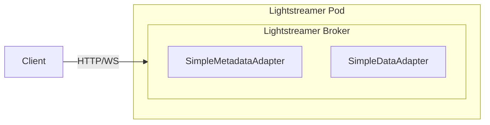

# In-Process Adapter example

This example demonstrates how to deploy the Lightstreamer Helm chart with **In-Process Adapters**, where the adapter logic runs inside the Lightstreamer JVM as part of the server process.

## Architecture



Lightstreamer is configured with:
- an **In-Process** Metadata Adapter (`SimpleMetadataAdapter`)
- an **In-Process** Data Adapter (`SimpleDataAdapter`)

Both adapters are compiled into a JAR and baked into a custom Docker image that extends the official Lightstreamer image.

## The example Adapter Set project

The [`example-adapter-set/`](example-adapter-set/) folder is a self-contained Gradle project that produces a sample Adapter Set with two adapters:

- `SimpleMetadataAdapter` (extends `LiteralBasedProvider`) — handles client authentication and item validation
- `SimpleDataAdapter` — generates sample real-time data

The project is organized as follows:

```
example-adapter-set/
├── src/main/java/…               # Java adapter source code
├── build.gradle                   # Gradle build — compiles and assembles the adapter JAR
├── Dockerfile                     # Extends the official Lightstreamer image
├── index.html                     # Test page — subscribes to the example Adapter Set
├── deploy.sh                      # Build + package + push (Kubernetes or OpenShift)
└── undeploy.sh                    # Clean up images and cluster resources
```

**Build pipeline** — `deploy.sh` automates the full chain:

1. Runs `gradlew build`, which compiles the adapter classes and assembles them into `build/libs/example-adapter-set-1.0.0.jar`.
2. Builds a Docker image using the Dockerfile, which copies the compiled adapter and the test page into the Lightstreamer image:
   ```dockerfile
   FROM lightstreamer
   COPY build/libs/example-adapter-set-1.0.0.jar /lightstreamer/adapters/example-adapter-set/lib/
   COPY index.html /lightstreamer/pages/index.html
   ```
3. Pushes the image to the target registry (or triggers an OpenShift server-side build).

You can use this project as a starting point for your own adapters — replace the source code under `src/`, adjust `build.gradle`, and follow the deployment steps below.

## Prerequisites

- A running Kubernetes cluster with `kubectl` configured, or an OpenShift cluster with `oc` available
- `helm` on your PATH
- The Lightstreamer Helm repository added:
  ```sh
  helm repo add lightstreamer https://lightstreamer.github.io/helm-charts
  helm repo update
  ```
- A container registry accessible by the cluster nodes (e.g. Docker Hub, a private registry, or a local registry) — required for the `kubernetes` target
- `docker` on your PATH for local image builds
- A Java JDK (17+) for building the Adapter Set with Gradle

## Deployment

### 1. Build the custom image

From the [`example-adapter-set/`](example-adapter-set/) folder, run `deploy.sh` with the appropriate target:

```sh
cd example-adapter-set/
```

- **Any Kubernetes distribution** — build and push the image to a registry accessible by your cluster nodes:
  ```sh
  REGISTRY=myregistry.example.com/myorg ./deploy.sh kubernetes
  ```
  Set `REGISTRY` to the prefix of your container registry. The image will be tagged and pushed as `${REGISTRY}/lightstreamer-example-adapter-set:latest`.

  > **Minikube shortcut**: If you are using Minikube for local development you can avoid a remote registry entirely by pointing your shell at Minikube's built-in Docker daemon before running the script. The image is then built directly inside Minikube and no push is needed:
  > ```sh
  > eval $(minikube docker-env)
  > ./deploy.sh kubernetes
  > ```
  > Run `eval $(minikube docker-env --unset)` to restore your shell's Docker environment afterwards.

- **OpenShift** — no local Docker build is needed. The script uploads the source directory and triggers a server-side build via a binary BuildConfig:
  ```sh
  ./deploy.sh openshift
  ```

At the end, the script prints the `image.repository` and `image.tag` values to set in your Helm values file.

### 2. Install the Lightstreamer Helm chart

Install the chart using the provided [`values.yaml`](values.yaml), overriding the image to point to the custom image built in the previous step:

```sh
helm install lightstreamer lightstreamer/lightstreamer \
  -f values.yaml \
  --set image.repository=lightstreamer-example-adapter-set \
  --set image.tag=latest \
  --namespace lightstreamer
```

For OpenShift, use the image reference printed by `deploy.sh`, for example:

```sh
helm install lightstreamer lightstreamer/lightstreamer \
  -f values.yaml \
  --set image.repository=image-registry.openshift-image-registry.svc:5000/lightstreamer/lightstreamer-example-adapter-set \
  --set image.tag=latest \
  --namespace lightstreamer
```

> [!NOTE]
> The namespace must exist beforehand (`kubectl create namespace lightstreamer` or `oc new-project lightstreamer` on OpenShift).

The provided [`values.yaml`](values.yaml) defines the Adapter Set with the two In-Process Adapters (`SimpleMetadataAdapter` and `SimpleDataAdapter`) and provisions them from the path baked into the custom image.

### 3. Verify the deployment

Check the Lightstreamer pod logs to confirm the Adapter Set has loaded successfully:

```sh
kubectl logs -l app.kubernetes.io/name=lightstreamer -n lightstreamer
```

The included [`index.html`](example-adapter-set/index.html) page is also baked into the custom image and served by Lightstreamer's built-in web server. To try it, forward the service port and open it in your browser:

```sh
kubectl port-forward svc/lightstreamer-service 8080:8080 -n lightstreamer
```

Then open <http://localhost:8080/index.html> — the page subscribes to the `greetings` item and displays the `message` and `timestamp` fields.

> [!NOTE]
> `kubectl port-forward` does not support streaming protocols (WebSocket or HTTP chunked), so updates will arrive slowly via recovery polling. For real-time performance, expose the service through an Ingress or a load balancer that supports streaming connections.

## Cleanup

Uninstall the Helm chart first to stop the pods using the custom image:

```sh
helm uninstall lightstreamer --namespace lightstreamer
```

Then remove the image from the [`example-adapter-set/`](example-adapter-set/) folder:

- **Any Kubernetes distribution**:
  ```sh
  REGISTRY=myregistry.example.com/myorg ./undeploy.sh kubernetes
  ```
  Removes the local Docker image (if `REGISTRY` is set).

- **OpenShift**:
  ```sh
  ./undeploy.sh openshift
  ```
  Removes the BuildConfig and ImageStream from the cluster.

