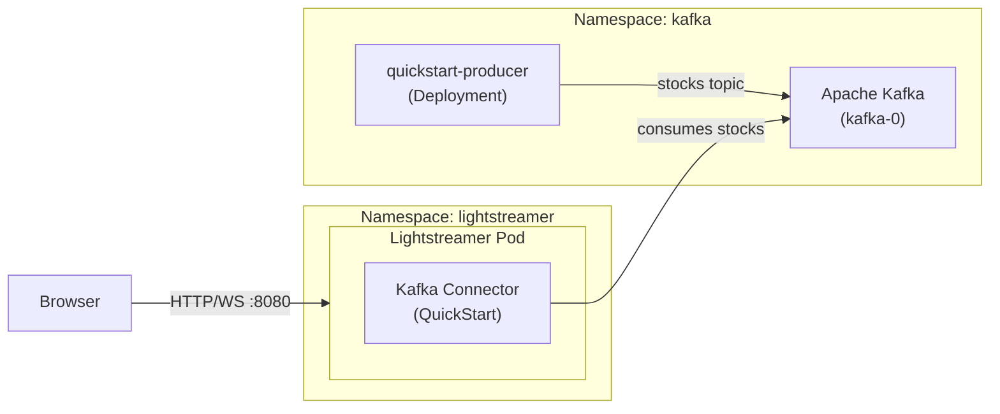

# Kafka Connector example

This example is the Kubernetes equivalent of the [Lightstreamer Kafka Connector Quickstart](https://github.com/Lightstreamer/Lightstreamer-kafka-connector/tree/main/examples/quickstart). It demonstrates real-time streaming of simulated stock market events from a Kafka topic to a web browser via the Lightstreamer Kafka Connector.

## Architecture



Lightstreamer is configured with the **Kafka Connector** consuming from the `stocks` Kafka topic. Incoming stock events — published as JSON values with an `INTEGER` key (the stock index) — are routed to Lightstreamer items following the `stock-[index=N]` template and streamed in real time to the web client served at `/QuickStart`.

The simulated producer continuously publishes stock market events (price changes, bids, asks, etc.) to the `stocks` topic on behalf of 30 different instruments.

## Prerequisites

- A running Kubernetes cluster with `kubectl` configured, or an OpenShift cluster with `oc` available
- `helm` on your PATH
- The Lightstreamer Helm repository added:
  ```sh
  helm repo add lightstreamer https://lightstreamer.github.io/helm-charts
  helm repo update
  ```
- `docker` on your PATH and a container registry accessible by the cluster nodes, for building and pushing the producer image
- JDK 17+ on your machine to build the producer jar

## Deployment

### 1. Deploy Kafka

Deploy a single-node Apache Kafka broker in KRaft mode (no Zookeeper) using the official [`apache/kafka`](https://hub.docker.com/r/apache/kafka) Docker image — the same image used in the original docker-compose quickstart:

```sh
kubectl apply -f kafka.yaml
```

Wait for the broker to be ready:

```sh
kubectl rollout status statefulset/kafka -n kafka
```

This creates a combined controller/broker pod named `kafka-0`, reachable within the cluster at `kafka-0.kafka.kafka.svc.cluster.local:9092`.

### 2. Build and push the producer image

Clone the Lightstreamer Kafka Connector repository and build the quickstart producer Docker image:

```sh
git clone https://github.com/Lightstreamer/Lightstreamer-kafka-connector.git
cd Lightstreamer-kafka-connector/examples/quickstart-producer
./build.sh
docker build -t <your-registry>/quickstart-producer:latest .
docker push <your-registry>/quickstart-producer:latest
```

### 3. Deploy the producer

Edit [`producer.yaml`](producer.yaml) and replace `<your-registry>/quickstart-producer:latest` with the image reference pushed in the previous step, then apply it:

```sh
kubectl apply -f producer.yaml
```

Verify the producer is running and publishing to the `stocks` topic:

```sh
kubectl logs -l app=quickstart-producer -n kafka
```

### 4. Install the Lightstreamer Helm chart

```sh
kubectl create namespace lightstreamer

helm install lightstreamer lightstreamer/lightstreamer \
  -f values.yaml \
  --namespace lightstreamer
```

Check the logs to confirm the Kafka Connector has loaded and is consuming from the `stocks` topic:

```sh
kubectl logs -l app.kubernetes.io/name=lightstreamer -n lightstreamer
```

## Accessing the web client

The `ghcr.io/lightstreamer/lightstreamer-kafka-connector` image does **not** include the QuickStart web client. The provided [`values.yaml`](values.yaml) uses an init container (`web-client`) to download the web client files from the Lightstreamer Kafka Connector GitHub repository into a shared volume (`web-volume`), which is then referenced by `webServer.pagesVolume` so that the internal web server serves it at `/QuickStart`.

- **Any Kubernetes distribution** — forward the service port and open the page in your browser:

  ```sh
  kubectl port-forward svc/lightstreamer-service 8080:8080 -n lightstreamer
  ```

  Then open <http://localhost:8080/QuickStart>.

  > [!NOTE]
  > `kubectl port-forward` does not support streaming protocols (WebSocket or HTTP chunked), so updates will arrive slowly via recovery polling. For real-time performance, expose the service through an Ingress or a load balancer that supports streaming connections.

- **OpenShift** — expose the service as a Route and open the generated URL:

  ```sh
  oc expose svc/lightstreamer-service -n lightstreamer
  ```

  Then open `http://<route-hostname>/QuickStart`, where `<route-hostname>` is printed by:

  ```sh
  oc get route lightstreamer-service -n lightstreamer -o jsonpath='{.spec.host}'
  ```

## Cleanup

```sh
helm uninstall lightstreamer --namespace lightstreamer
kubectl delete -f producer.yaml
kubectl delete -f kafka.yaml
```
```
