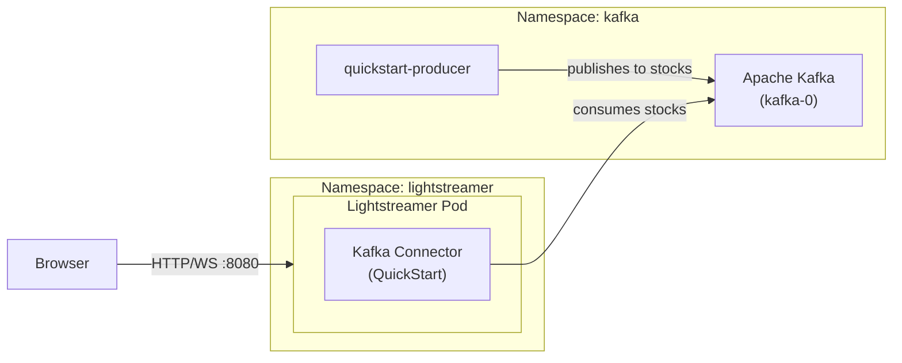

# Kafka Connector example

This example is the Kubernetes equivalent of the [Lightstreamer Kafka Connector Quickstart](https://github.com/Lightstreamer/Lightstreamer-kafka-connector/tree/main/examples/quickstart). It demonstrates real-time streaming of simulated stock market events from a Kafka topic to a web browser via the Lightstreamer Kafka Connector.

## Architecture



Lightstreamer is configured with the **Kafka Connector** consuming from the `stocks` Kafka topic. Incoming stock events — published as JSON values with an `INTEGER` key (the stock index) — are routed to Lightstreamer items following the `stock-[index=N]` template and streamed in real time to the web client served at `/QuickStart`.

The simulated producer continuously publishes stock market events (price changes, bids, asks, etc.) to the `stocks` topic on behalf of 30 different instruments.

## Prerequisites

- A running Kubernetes cluster with `kubectl` configured, or an OpenShift cluster with `oc` available
- `helm` on your PATH
- The Lightstreamer Helm repository added:
  ```sh
  helm repo add lightstreamer https://lightstreamer.github.io/helm-charts
  helm repo update
  ```
- `docker` on your PATH and a container registry accessible by the cluster nodes, for building and pushing the producer image (not required on OpenShift — the image can be built server-side)

## Deployment

### 1. Deploy Kafka

Deploy a single-node Apache Kafka broker in KRaft mode using the official [`apache/kafka`](https://hub.docker.com/r/apache/kafka) Docker image — the same image used in the original docker-compose quickstart:

- **Any Kubernetes distribution**:
  ```sh
  kubectl apply -f kafka.yaml
  kubectl rollout status statefulset/kafka -n kafka
  ```

- **OpenShift**:
  ```sh
  oc apply -f kafka.yaml
  oc rollout status statefulset/kafka -n kafka
  ```

> [!NOTE]
> **OpenShift only**: The `apache/kafka` image runs as a fixed non-root user ID. If your cluster enforces the `restricted` SCC, grant `anyuid` to the default service account before applying (create the project first if it does not already exist):
> ```sh
> oc new-project kafka  # skip if the project already exists
> oc adm policy add-scc-to-serviceaccount anyuid -z default -n kafka
> ```

This creates a combined controller/broker pod named `kafka-0`, reachable within the cluster at `kafka-0.kafka.kafka.svc.cluster.local:9092`.

### 2. Build and deploy the producer

Build the producer image using the provided [`producer.Dockerfile`](producer.Dockerfile) (no local JDK required — the build runs inside Docker), then deploy it.

- **Any Kubernetes distribution** — build and push the image to a registry accessible by your cluster nodes:
  ```sh
  docker build -f producer.Dockerfile -t <your-registry>/quickstart-producer:latest .
  docker push <your-registry>/quickstart-producer:latest
  ```

  > **Minikube shortcut**: Point your shell at Minikube's built-in Docker daemon to build the image directly inside Minikube and skip the push entirely:
  > ```sh
  > eval $(minikube docker-env)
  > docker build -f producer.Dockerfile -t quickstart-producer:latest .
  > eval $(minikube docker-env --unset)
  > ```
  > Use `quickstart-producer:latest` as the image reference in `producer.yaml` and add `imagePullPolicy: Never` to the container spec.

  Then edit [`producer.yaml`](producer.yaml), replace `<your-registry>/quickstart-producer:latest` with your image reference, and apply:
  ```sh
  kubectl apply -f producer.yaml
  kubectl rollout status deployment/quickstart-producer -n kafka
  kubectl logs -l app=quickstart-producer -n kafka  
  ```

- **OpenShift** — use an OpenShift binary build to build the image server-side and push it to the internal registry. No local Docker daemon is required:
  ```sh
  oc new-build --name=quickstart-producer --binary --strategy=docker -n kafka
  oc start-build quickstart-producer --from-file=producer.Dockerfile --follow -n kafka
  ```

  Once the build completes, the image is available at:
  ```
  image-registry.openshift-image-registry.svc:5000/kafka/quickstart-producer:latest
  ```

  Edit [`producer.yaml`](producer.yaml) and set the image to the above reference, then apply:
  ```sh
  oc apply -f producer.yaml
  oc rollout status deployment/quickstart-producer -n kafka
  oc logs -l app=quickstart-producer -n kafka
  ```

### 3. Install the Lightstreamer Helm chart

- **Any Kubernetes distribution**:
  ```sh
  kubectl create namespace lightstreamer
  helm install lightstreamer lightstreamer/lightstreamer \
    -f values.yaml \
    --namespace lightstreamer
  kubectl rollout status deployment/lightstreamer -n lightstreamer
  kubectl logs -l app.kubernetes.io/name=lightstreamer -n lightstreamer
  ```

- **OpenShift**:
  ```sh
  oc new-project lightstreamer
  helm install lightstreamer lightstreamer/lightstreamer \
    -f values.yaml \
    --namespace lightstreamer
  oc rollout status deployment/lightstreamer -n lightstreamer
  oc logs -l app.kubernetes.io/name=lightstreamer -n lightstreamer
  ```

Check the logs to confirm the Kafka Connector has loaded and is consuming from the `stocks` topic.

## Accessing the web client

The `ghcr.io/lightstreamer/lightstreamer-kafka-connector` image does **not** include the QuickStart web client. The provided [`values.yaml`](values.yaml) handles this automatically: an init container downloads the web client from GitHub into a shared volume, which `webServer.pagesVolume` mounts as the web server root so the page is served at `/QuickStart`.

- **Any Kubernetes distribution** — forward the service port and open the page in your browser:

  ```sh
  kubectl port-forward svc/lightstreamer-service 8080:8080 -n lightstreamer
  ```

  Then open <http://localhost:8080/QuickStart>.

  > [!NOTE]
  > `kubectl port-forward` does not support streaming protocols (WebSocket or HTTP chunked), so updates will arrive slowly via recovery polling. For real-time performance, expose the service through an Ingress or a load balancer that supports streaming connections.

- **OpenShift** — expose the service as a Route and open the generated URL:

  ```sh
  oc expose svc/lightstreamer-service -n lightstreamer
  ```

  Then open `http://<route-hostname>/QuickStart`, where `<route-hostname>` is printed by:

  ```sh
  oc get route lightstreamer-service -n lightstreamer -o jsonpath='{.spec.host}'
  ```

## Cleanup

- **Any Kubernetes distribution**:
  ```sh
  helm uninstall lightstreamer --namespace lightstreamer
  kubectl delete -f producer.yaml
  kubectl delete -f kafka.yaml
  ```

- **OpenShift**:
  ```sh
  helm uninstall lightstreamer --namespace lightstreamer
  oc delete -f producer.yaml
  oc delete -f kafka.yaml
  oc delete project lightstreamer
  oc delete project kafka
  ```
