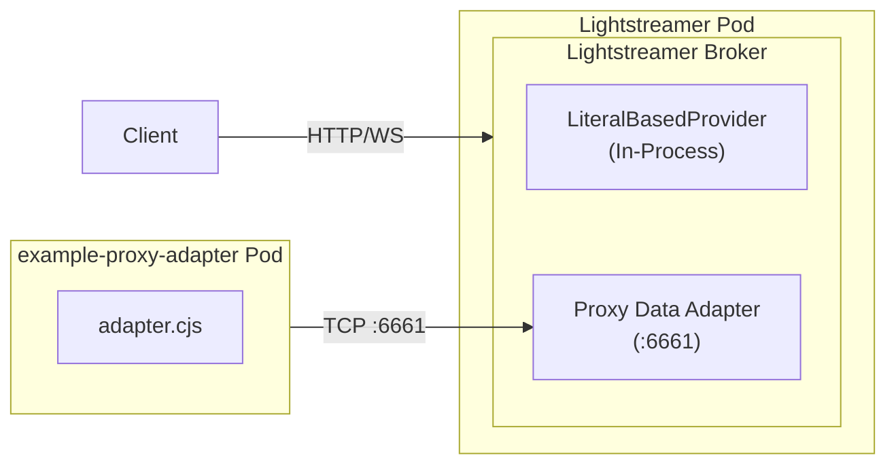

# Proxy Adapter example

This example demonstrates how to deploy the Lightstreamer Helm chart with a **Proxy Data Adapter**, which delegates data production to a separate remote adapter process running in its own Kubernetes pod.

## Architecture



Lightstreamer is configured with:
- an **In-Process** Metadata Adapter (`LiteralBasedProvider`, provided by the Lightstreamer SDK)
- a **Proxy Data Adapter** listening on port `6661` for incoming connections from the remote adapter

The NodeJS remote adapter connects to Lightstreamer on port `6661` and pushes Hello World–style real-time data (alternating "Hello" / "World" messages), as configured by the arguments in [`deployment.yaml.tmpl`](example-proxy-adapter-set/deployment.yaml.tmpl):

```yaml
args:
  - lightstreamer-adapters.lightstreamer.svc   # Lightstreamer service hostname
  - "6661"                                     # Proxy adapter port
```

## The example remote adapter project

The [`example-proxy-adapter-set/`](example-proxy-adapter-set/) folder contains a NodeJS remote adapter that produces sample real-time data. The project is organized as follows:

```
example-proxy-adapter-set/
├── adapter.cjs                          # NodeJS adapter source code
├── Dockerfile                           # Packages the adapter into a container
├── deployment.yaml.tmpl                 # Kubernetes Deployment manifest template
├── index.html                           # Test page — subscribes to the example Adapter Set
├── build.sh                             # Build + package (Kubernetes or OpenShift)
└── undeploy.sh                          # Clean up deployment and images
```

## Prerequisites

- A running Kubernetes cluster with `kubectl` configured, or an OpenShift cluster with `oc` available
- `helm` on your PATH
- The Lightstreamer Helm repository added:
  ```sh
  helm repo add lightstreamer https://lightstreamer.github.io/helm-charts
  helm repo update
  ```
- A container registry accessible by the cluster nodes (e.g. Docker Hub, a private registry, or a local registry) — required for the `kubernetes` target
- `docker` on your PATH for local image builds

## Deployment

### 1. Build the remote adapter image

From the [`example-proxy-adapter-set/`](example-proxy-adapter-set/) folder, run `build.sh` with the appropriate target. Optionally edit [`adapter.cjs`](example-proxy-adapter-set/adapter.cjs) beforehand to customise the adapter logic.

```sh
cd example-proxy-adapter-set/
```

- **Any Kubernetes distribution** — build and push the image to a registry accessible by your cluster nodes:
  ```sh
  REGISTRY=myregistry.example.com/myorg ./build.sh kubernetes
  ```
  Set `REGISTRY` to the prefix of your container registry. The image will be tagged and pushed as `${REGISTRY}/example-proxy-adapter:1.0.0`.

  > **Minikube shortcut**: If you are using Minikube for local development you can avoid a remote registry entirely by pointing your shell at Minikube's built-in Docker daemon before running the script. The image is then built directly inside Minikube and no push is needed:
  > ```sh
  > eval $(minikube docker-env)
  > ./build.sh kubernetes
  > ```
  > Run `eval $(minikube docker-env --unset)` to restore your shell's Docker environment afterwards.

- **OpenShift** — no local Docker build is needed. The script uploads the source directory and triggers a server-side build via a binary BuildConfig:
  ```sh
  ./build.sh openshift
  ```

At the end, the script prints the command to deploy the remote adapter (used in step 3).

### 2. Install the Lightstreamer Helm chart

Install the chart using the provided [`values.yaml`](values.yaml), which configures the Proxy Data Adapter:

```sh
helm install lightstreamer lightstreamer/lightstreamer \
  -f values.yaml \
  --namespace lightstreamer
```

> [!NOTE]
> The namespace must exist beforehand (`kubectl create namespace lightstreamer` or `oc new-project lightstreamer` on OpenShift). Any name can be used, but it must be applied consistently — if you change it, update [`deployment.yaml.tmpl`](example-proxy-adapter-set/deployment.yaml.tmpl) accordingly, as the namespace is also part of the Lightstreamer service DNS hostname.

The provided [`values.yaml`](values.yaml) defines an Adapter Set with an In-Process Metadata Adapter (`LiteralBasedProvider`, provided by the Lightstreamer SDK) and a Proxy Data Adapter listening on port `6661` for incoming connections from the remote adapter.

### 3. Deploy the remote adapter

Once Lightstreamer is running and the Proxy Data Adapter is ready to accept connections, deploy the remote adapter by running the command printed by `build.sh` in step 1. For example:

- **Any Kubernetes distribution**:
  ```sh
  IMAGE_REF=example-proxy-adapter:1.0.0 envsubst '${IMAGE_REF}' < deployment.yaml.tmpl | kubectl apply -f -
  ```

- **OpenShift** — use the image reference printed by `build.sh`, for example:
  ```sh
  IMAGE_REF=image-registry.openshift-image-registry.svc:5000/lightstreamer/example-proxy-adapter:1.0.0 envsubst '${IMAGE_REF}' < deployment.yaml.tmpl | kubectl apply -f -
  ```

This generates the Deployment manifest from [`deployment.yaml.tmpl`](example-proxy-adapter-set/deployment.yaml.tmpl) with the resolved image reference and applies it to the cluster. The remote adapter pod will start and connect to Lightstreamer on port `6661`.

### 4. Verify the deployment

Check the Lightstreamer pod logs to confirm the remote adapter has connected successfully:

```sh
kubectl logs -l app.kubernetes.io/name=lightstreamer -n lightstreamer
```

The included [`index.html`](example-proxy-adapter-set/index.html) page can also be used to verify data flow end-to-end. Forward the service port so the page can reach Lightstreamer, then open `index.html` directly from the local filesystem in your browser:

```sh
kubectl port-forward svc/lightstreamer-service 8080:8080 -n lightstreamer
```

> [!NOTE]
> Unlike the [In-Process Adapter example](../in-process-adapters/), the test page is not baked into the Lightstreamer image — open the local file directly in your browser while port-forward is running. This applies to both Kubernetes and OpenShift (`oc port-forward` can be used as well).

> [!NOTE]
> `kubectl port-forward` does not support streaming protocols (WebSocket or HTTP chunked), so updates will arrive slowly via recovery polling. For real-time performance, expose the service through an Ingress or a load balancer that supports streaming connections.

## Cleanup

Uninstall the Helm chart first to stop the pods:

```sh
helm uninstall lightstreamer --namespace lightstreamer
```

Then remove the NodeJS adapter resources from the [`example-proxy-adapter-set/`](example-proxy-adapter-set/) folder:

- **Any Kubernetes distribution**:
  ```sh
  REGISTRY=myregistry.example.com/myorg ./undeploy.sh kubernetes
  ```
  Deletes the NodeJS adapter deployment and removes the local Docker image (if `REGISTRY` is set).

- **OpenShift**:
  ```sh
  ./undeploy.sh openshift
  ```
  Deletes the NodeJS adapter deployment, the BuildConfig, and the ImageStream from the cluster.

